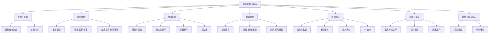
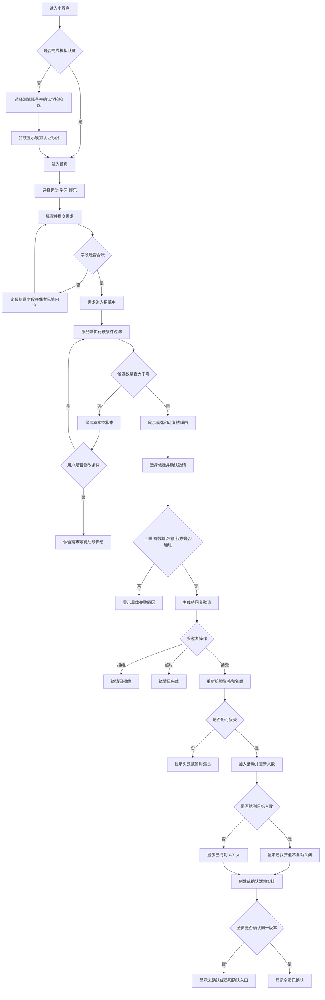
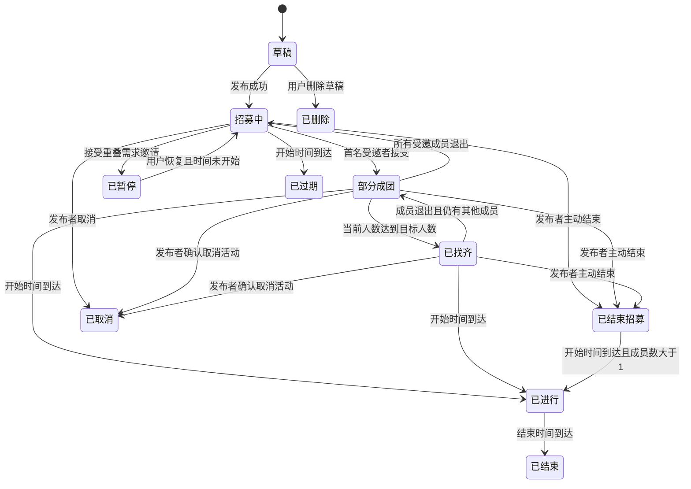
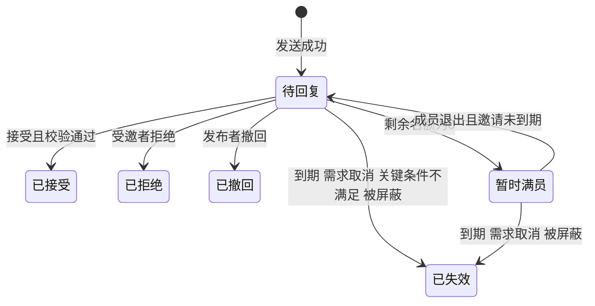
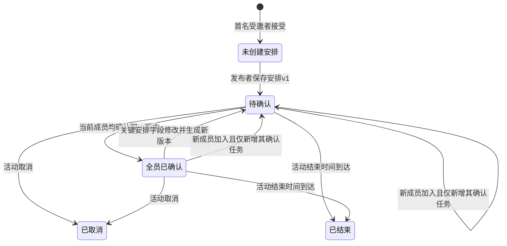

# 搭哒同校找搭子平台产品需求文档

## 关键决策结论

> 以下结论用于统一当前版本的产品范围、业务规则和验收口径。

| 编号 | 决策结论 |
| --- | --- |
| KD-01 | 产品名称使用“搭哒”。本期产品形态按微信小程序设计。 |
| KD-02 | 本期为 0→1 的可运行首版。校内认证、站内通知和 AI 话术均使用模拟服务，但通过统一接口封装，页面持续显示“模拟”标识。 |
| KD-03 | 候选对象是一条有效的“找搭子需求”，候选卡同时展示该需求的发布者。一个用户存在多条不同时段需求时，可分别成为候选；同一候选需求只出现一次。 |
| KD-04 | 用户接受与自己需求时间重叠的邀请前，系统必须展示影响确认页。接受后，重叠的个人需求转为“已暂停”，该需求发出的待回复邀请全部撤回并通知相关受邀者；用户可在退出活动后手动恢复未过期且时间未开始的需求。 |
| KD-05 | “当前人数”由系统根据成员记录计算，发布者固定计为 1 人；首版不支持录入未注册的线下成员。 |
| KD-06 | 目标总人数允许 2—4 人，包含发布者。每条需求最多同时存在 5 条待回复或暂时满员的有效邀请。 |
| KD-07 | 一条需求只支持一个日期和一个连续时间段；选择粒度为 15 分钟；开始时间必须晚于服务端当前时间 30 分钟；单次时长为 30 分钟至 8 小时；可预约未来 14 天。双方时间交集至少为 30 分钟。 |
| KD-08 | 具体事项优先从受控词表单选；“其他”需要输入 2—20 个字符。首版词表只作为产品配置和测试词表，不表述为调研结论。 |
| KD-09 | 自身性别必须完成一次选择，选项为男、女、其他、不愿透露；搭子性别偏好为多选，默认“不限”，“不限”与其他选项互斥。候选卡不展示性别原值，只展示“双方偏好符合”。 |
| KD-10 | 线上需求不限制校区；线下需求首版只匹配同一学校、同一校区。校区词表由产品配置，模拟认证账号预置学校和可选校区。 |
| KD-11 | 达到目标人数后显示“已找齐 X/Y 人”，不自动关闭。发布者可主动“结束招募”；活动开始前可以“取消活动”，取消后所有有效邀请失效并通知成员。 |
| KD-12 | 只有发布者可以直接创建或修改安排版本；其他已加入成员可提交修改建议。发布者保存新版本时使用版本号校验，出现并发冲突则要求刷新后重试。 |
| KD-13 | 新成员加入且安排字段未改变时，只要求新成员确认；成员退出不重置其他成员确认。日期、开始时间、结束时间、参与方式、校区或集合地点发生变化时，创建新版本并重置全员确认。 |
| KD-14 | 联系方式类型支持微信号、手机号和其他，用户加入活动后可主动公开。联系方式加密保存；活动结束 30 天后删除。 |
| KD-15 | 上线后的首个效果评估周期为连续 4 周，且至少积累 100 条有效发布需求；在样本条件满足前只建立基线，不承诺增长目标。 |

---

# 0 文档信息

## 0.1 基本信息

| 项目 | 内容 |
| --- | --- |
| 文档标题 | 搭哒同校找搭子平台产品需求文档 |
| 版本号 | PRD v4.0 |
| 产品名称 | 搭哒 |
| 产品形态 | 微信小程序 |
| 产品类型 | To C |
| 所属行业 | 校园生活服务 |
| 目标用户 | 有运动、学习或娱乐搭子需求的同校用户 |
| 需求性质 | 0→1 新产品 |
| 当前阶段 | 评审前 |
| 文档状态 | 评审中 |
| 作者 | 产品方案整理 |
| 创建日期 | 2026-09-14 |
| 更新日期 | 2026-09-16 |

## 0.2 相关人员

| 角色 | 负责人 |
| --- | --- |
| 产品负责人 | 产品方案整理 |
| 研发负责人 | 进入研发阶段后由项目组安排 |
| 设计负责人 | 进入设计阶段后由项目组安排 |
| 测试负责人 | 进入测试阶段后由项目组安排 |
| 数据负责人 | 进入数据建设阶段后由项目组安排 |
| 运营负责人 | 本期不涉及；首版无独立运营后台。 |

## 0.3 变更记录

| 版本 | 日期 | 修改人 | 修改内容 |
| --- | --- | --- | --- |
| v3.1 | 2026-09-14 | 产品方案整理 | 扩展为运动、学习、娱乐三类同校找搭子平台。 |
| v4.0 | 2026-09-16 | 产品方案整理 | 按评审级 PRD 结构重组，补充 FR、BR、NFR、EV、状态机、异常与验收映射。 |

## 0.4 关联文档

| 文档 | 状态 | 链接 |
| --- | --- | --- |
| 项目申请书 | 已有 | 未提供 |
| MRD | 本期不单独提供；需求依据合并在本 PRD 第 1—3 章。 | — |
| 交互原型 | 待产出 | 未提供 |
| UI 设计稿 | 待产出 | 未提供 |
| 技术方案 | 待技术评审 | 未提供 |
| 接口文档 | 待技术评审 | 未提供 |
| 埋点文档 | 需求见第 8 章 | 未提供 |

---

# 1 需求背景与目标

## 1.1 需求背景

原申请书将产品设想为面向大学生的轻量化搭子平台，覆盖运动、学习和兴趣活动，并计划采用微信小程序。申请书中记载了访谈、问卷和公开内容采集数量，但当前没有原始问卷、样本结构、访谈纪要和清洗数据，因此不能据此声明需求已经被验证。

同校用户在聊天群、朋友圈或熟人关系中寻找搭子时，事项、时间、地点、人数和参与要求分散，需要重复询问；发布者难以确认谁真正符合条件，参与者也可能在接受前无法看清安排。

首版聚焦“围绕一件具体事项找人并确认安排”，不承载社区内容流。运动、学习和娱乐共用发布、筛选、邀请、接受和安排确认流程。

## 1.2 需求目标

| 目标编号 | 目标 | 验证方式 |
| --- | --- | --- |
| OBJ-01 | 用户可以完成一条字段合法的找搭子需求发布。 | 发布成功事件与字段校验用例全部通过。 |
| OBJ-02 | 候选仅由公开硬规则产生，无合格候选时返回空结果。 | 使用固定测试集复算候选结果，前后端结果一致。 |
| OBJ-03 | 支持 2—4 人活动的邀请、接受、满员、退出和恢复招募。 | 状态机与并发验收用例通过。 |
| OBJ-04 | 所有当前成员能够确认同一版活动安排。 | 安排版本与逐人确认记录一致。 |
| OBJ-05 | AI 只生成三条可编辑、可复制的话术，未经用户操作不得发送。 | AI 权限和发送边界用例通过。 |
| OBJ-06 | 模拟认证、模拟通知和模拟 AI 在所有相关页面持续可见。 | 页面巡检和 UI 自动化用例通过。 |

## 1.3 核心指标

> 业务指标在首个评估周期内只建立基线。没有真实上线数据前，不写入虚构的当前值或增长目标。

| 指标 | 指标角色 | 当前值 | 首期目标 | 统计口径 | 评估时限 |
| --- | --- | ---: | ---: | --- | --- |
| 全员确认需求率 | 北极星指标 | 无基线 | 建立基线，不设增长承诺 | 达到“全员已确认”的需求数 ÷ 有至少 1 名受邀者接受的需求数 | 连续 4 周且有效发布需求 ≥100 条 |
| 有效发布率 | 关键结果 | 无基线 | 建立基线 | 发布成功用户数 ÷ 进入发布页且产生有效输入的去重用户数 | 同上 |
| 候选非空率 | 诊断指标 | 无基线 | 按运动、学习、娱乐分别建立基线 | 至少返回 1 条合格候选的需求数 ÷ 已发布需求数 | 同上 |
| 邀请接受率 | 关键结果 | 无基线 | 建立基线 | 已接受邀请数 ÷ 已结束邀请数；已结束包括接受、拒绝、撤回、失效 | 同上 |
| 空结果恢复率 | 体验指标 | 无基线 | 建立基线 | 空结果后 24 小时内修改条件并获得候选的需求数 ÷ 空结果需求数 | 同上 |
| 安排确认完成时长 | 体验指标 | 无基线 | 建立 P50、P90 | 首名成员接受至全员确认当前安排版本的耗时 | 同上 |

## 1.4 需求价值

对用户的价值是减少反复询问，在接受邀请前明确事项、时间、参与方式和人数，并在成员变化时看到真实状态。

对产品的价值是验证“结构化需求 + 规则匹配 + 邀请确认”是否足以支持同校找搭子，而不依赖内容社区或完整即时通讯。

若不做本期能力，无法验证跨运动、学习、娱乐的通用找搭子流程，也无法形成候选为空、多人并发和安排版本等关键场景的真实行为数据。

---

# 2 用户与场景分析

## 2.1 目标用户画像

| 用户角色 | 特征 | 使用动机 | 预期频次 |
| --- | --- | --- | --- |
| 需求发布者 | 同校用户；已完成模拟认证；有明确事项和大致时间 | 找到满足必要条件的人并组织活动 | 事件触发型，不设固定频次 |
| 受邀者 | 自己也存在有效需求，或被其他需求匹配 | 在接受前确认共同条件、差异和时间 | 事件触发型 |
| 已加入成员 | 已接受邀请并进入活动 | 确认安排、选择是否公开联系方式、必要时退出 | 每次活动 1 次以上 |

## 2.2 用户故事

| 编号 | 用户故事 |
| --- | --- |
| US-001 | 作为需求发布者，在想找同校用户一起完成具体事项时，我想填写事项、时间、参与方式、人数和必要偏好，以便获得符合硬条件的候选。 |
| US-002 | 作为需求发布者，在查看候选时，我想看到候选出现的可复核理由和仍需协商的差异，以便决定是否邀请。 |
| US-003 | 作为受邀者，在收到邀请时，我想在接受前看到完整需求、剩余名额和截止时间，以便判断是否参加。 |
| US-004 | 作为发布者，在邀请多人时，我想让系统控制待回复上限和剩余名额，以便避免超员。 |
| US-005 | 作为已加入成员，在活动安排发生变化时，我想看到具体差异并确认新版本，以便所有人对同一安排达成一致。 |
| US-006 | 作为已加入成员，在不知道如何开场时，我想主动生成并编辑破冰话术，以便由我决定是否复制和发送。 |
| US-007 | 作为重视隐私的用户，我想控制性别信息和联系方式的可见范围，以便在不公开敏感信息的情况下参与匹配。 |

## 2.3 用户痛点与替代方案

| 场景 | 当前替代方案 | 问题判断 | 本期方案 |
| --- | --- | --- | --- |
| 发布找人信息 | 群聊、朋友圈、熟人转发 | 信息字段不完整，需要反复追问 | 结构化发布表单 |
| 判断是否合适 | 查看零散文字，自行私聊确认 | 必要条件和可协商条件混在一起 | 硬条件过滤 + 差异展示 |
| 多人组织 | 人工统计人数和回复 | 易出现超员、漏回复和状态不同步 | 名额事务校验 + 邀请状态机 |
| 确认活动安排 | 群聊或私聊反复确认 | 成员可能确认了不同版本 | 结构化安排版本 + 逐人确认 |
| 初次沟通 | 用户自行组织语言 | 部分用户可能不知道如何开场 | 主动触发的 AI 话术辅助 |

---

# 3 竞品与参考分析

当前未提供可复核的竞品截图、版本、采集日期或体验记录，因此本版不输出竞品优劣结论，避免把常识性判断写成竞品事实。

## 3.1 后续竞品分析要求

| 分析维度 | 需要记录的内容 |
| --- | --- |
| 发布结构 | 类别、事项、时间、地点、人数、偏好字段及校验 |
| 匹配方式 | 推荐、搜索、筛选、排序和解释方式 |
| 邀请机制 | 邀请有效期、重复邀请、多人名额和满员处理 |
| 安全隐私 | 身份认证、性别展示、联系方式、举报和拉黑 |
| 沟通能力 | 私信、群聊、结构化安排和破冰辅助 |
| 数据依据 | 产品名称、版本、体验日期、截图或公开链接 |

---

# 4 需求范围

## 4.1 本期范围

- 同校模拟认证与测试账号标识。
- 运动、学习、娱乐三个一级类别。
- 需求发布、修改、暂停、恢复、结束招募和取消。
- 规则候选、候选解释、真实空结果和条件调整。
- 多人邀请、接受、拒绝、撤回、到期和暂时满员。
- 活动成员、名额和安排版本确认。
- 用户主动公开或关闭联系方式。
- 用户主动生成、编辑和复制 AI 破冰话术。
- 模拟站内通知与关键事件埋点。

## 4.2 不做范围

| 能力 | 本期结论 | 原因 |
| --- | --- | --- |
| 社区动态、内容推荐流、关注关系 | 本期不涉及 | 产品只解决具体事项找人。 |
| 支付、担保交易、费用分摊 | 本期不涉及 | 不属于首版找人闭环。 |
| 实时定位和轨迹 | 本期不涉及 | 校区和集合地点足以支持首版安排。 |
| 复杂用户画像、信用分、AI 匹配分 | 本期不涉及 | 缺少数据依据，且无法解释。 |
| 完整即时通讯、群聊和已读回执 | 本期不涉及 | 首版使用结构化安排和外部联系方式。 |
| 真实校园身份系统接入 | 本期不涉及 | 当前无法接入，使用持续标注的模拟认证。 |
| 运营后台 | 本期不涉及 | 词表和测试账号先由配置文件维护。 |
| 举报与处罚工作台 | 本期不涉及 | 首版不建设后台；但需保留用户屏蔽能力，见 FR-011。 |

## 4.3 优先级定义

| 优先级 | 定义 |
| --- | --- |
| P0 | 不实现则核心流程无法闭环或存在数据、隐私、并发错误，不能上线。 |
| P1 | 核心体验要求，本期必须实现；短时故障可降级但不能长期缺失。 |
| P2 | 重要能力，允许在不影响主流程时延期。 |
| P3 | 增强体验，本期不承诺。 |

## 4.4 功能清单

| 功能编号 | 模块 | 功能点 | 描述 | 优先级 | 所属端 |
| --- | --- | --- | --- | --- | --- |
| FR-001 | 身份 | 模拟校内认证 | 选择测试账号并形成学校、校区和模拟认证状态 | P0 | 小程序 |
| FR-002 | 需求 | 发布与管理需求 | 新建、编辑、暂停、恢复、结束招募和取消需求 | P0 | 小程序 |
| FR-003 | 匹配 | 候选筛选与排序 | 按硬条件返回候选并提供可复核解释 | P0 | 小程序/服务端 |
| FR-004 | 邀请 | 发送邀请 | 二次确认、去重、上限和三小时有效期 | P0 | 小程序/服务端 |
| FR-005 | 邀请 | 处理邀请 | 接受、拒绝、撤回、到期、暂时满员 | P0 | 小程序/服务端 |
| FR-006 | 活动 | 多人名额与成员 | 2—4 人、已找齐、退出和恢复招募 | P0 | 小程序/服务端 |
| FR-007 | 安排 | 安排版本与确认 | 创建安排、逐人确认、修改和版本重置 | P0 | 小程序/服务端 |
| FR-008 | 隐私 | 联系方式公开 | 已加入成员主动公开、关闭和退出后隐藏 | P1 | 小程序/服务端 |
| FR-009 | AI 辅助 | AI 破冰话术 | 主动生成三条话术，可编辑、复制、不代发 | P1 | 小程序/模拟服务 |
| FR-010 | 通知 | 模拟站内通知 | 关键状态变化生成可读通知并跳转详情 | P1 | 小程序/模拟服务 |
| FR-011 | 安全 | 屏蔽用户 | 屏蔽后双方不再成为候选，已有邀请失效 | P1 | 小程序/服务端 |
| FR-012 | 数据 | 行为埋点 | 记录非敏感行为事件并支持指标计算 | P1 | 小程序/服务端 |

---

# 5 整体方案设计

## 5.1 产品功能结构图

## 5.2 核心业务流程

## 5.3 角色与权限矩阵

| 操作 | 未认证用户 | 发布者 | 受邀者 | 已加入成员 | 被屏蔽用户 |
| --- | ---: | ---: | ---: | ---: | ---: |
| 浏览首页 | 允许 | 允许 | 允许 | 允许 | 允许 |
| 发布需求 | 禁止 | 允许 | 允许 | 允许，但受重叠时间限制 | 允许 |
| 修改需求 | 禁止 | 仅自己的需求 | 禁止 | 禁止 | 禁止 |
| 查看候选 | 禁止 | 仅自己的需求 | 禁止 | 禁止 | 禁止 |
| 发送邀请 | 禁止 | 允许 | 禁止 | 禁止 | 禁止 |
| 接受或拒绝邀请 | 禁止 | 作为受邀者时允许 | 允许 | 允许处理其他不冲突邀请 | 禁止相关对象 |
| 创建安排版本 | 禁止 | 允许 | 禁止 | 禁止直接创建，可提建议 | 禁止 |
| 确认安排 | 禁止 | 作为成员允许 | 接受前禁止 | 允许 | 禁止相关对象 |
| 公开联系方式 | 禁止 | 加入活动后允许 | 接受前禁止 | 允许 | 禁止相关对象 |
| 使用 AI 破冰 | 禁止 | 加入活动后允许 | 接受前禁止 | 允许 | 禁止相关对象 |
| 退出活动 | 禁止 | 不允许直接退出；需取消活动 | 禁止 | 允许 | 禁止 |

## 5.4 需求状态机

## 5.5 邀请状态机

## 5.6 活动与安排状态机

## 5.7 状态定义表

| 对象 | 状态 | 进入条件 | 可执行动作 | 退出条件 |
| --- | --- | --- | --- | --- |
| 需求 | 招募中 | 发布成功且只有发布者 | 查看候选、邀请、修改、暂停、结束招募、取消 | 成员接受、暂停、取消、到期 |
| 需求 | 部分成团 | 当前人数为 2 至目标人数减 1 | 继续邀请、创建安排、修改、结束招募、取消 | 满员、成员全部退出、取消、开始 |
| 需求 | 已找齐 | 当前人数等于目标人数 | 确认安排、结束招募、取消 | 成员退出、取消、开始 |
| 需求 | 已暂停 | 用户接受重叠活动 | 恢复、取消 | 恢复成功、开始时间到达 |
| 邀请 | 待回复 | 发送成功且仍有名额 | 接受、拒绝、撤回 | 相应动作、到期、满员 |
| 邀请 | 暂时满员 | 邀请有效但剩余名额为 0 | 查看详情 | 名额恢复或到期 |
| 安排 | 待确认 | 存在当前版本且有人未确认 | 确认、提交修改建议 | 全员确认、新版本、取消、结束 |
| 安排 | 全员已确认 | 全体当前成员确认同一版本 | 查看、提交修改建议 | 新成员加入、关键变更、取消、结束 |

---

# 6 功能需求详述

## 6.0 通用交互与错误处理约定

| 项目 | 统一规则 |
| --- | --- |
| 服务端时间 | 所有截止时间、活动开始时间和过期判断以服务端时间为准；客户端只负责展示。 |
| 防重复提交 | 提交类按钮点击后立即进入加载态；响应前禁止再次点击；服务端使用业务幂等键去重。 |
| 错误展示 | 字段错误显示在对应字段下方；页面级错误显示在页面顶部，不清空用户输入。 |
| 网络失败 | 展示“网络连接失败，请检查网络后重试”；读取失败允许重试，写入失败先查询服务端结果再决定是否重发。 |
| 权限不足 | 返回统一无权限状态，不展示目标对象的敏感信息。 |
| 模拟标识 | 模拟认证、模拟通知和模拟 AI 在对应内容附近显示“模拟能力”标签，不能只在首次进入时提示。 |
| 加载态 | 首次加载显示骨架屏；超过 10 秒未完成则结束加载并显示重试入口。 |
| 空数据 | 不插入虚构数据；说明为空的原因和用户可以执行的下一步。 |

## 6.1 FR-001 模拟校内认证

### 功能描述

用户进入发布、候选、邀请和活动能力前，必须完成模拟校内认证。模拟认证只提供测试账号、学校和校区字段，不代表接入真实校园身份系统。

### 对应用户故事

US-001、US-003、US-007。

### 前置条件与触发条件

- 前置条件：用户已进入小程序；测试账号配置加载成功。
- 触发条件：首次进入；认证状态失效；用户主动切换测试账号。

### 页面与入口

| 页面 | 入口 | 层级 |
| --- | --- | --- |
| 模拟认证页 | 首次进入自动跳转；“我的—测试账号” | 一级拦截页 |
| 认证说明弹层 | 点击“为什么是模拟认证” | 二级弹层 |

### 交互流程

1. 用户进入认证页，系统加载测试账号列表。
2. 用户选择测试账号，页面展示昵称、学校、校区和“模拟认证”标签。
3. 用户勾选“我已知晓当前为模拟认证”，点击“进入搭哒”。
4. 系统保存账号标识和认证状态，返回原目标页面或首页。
5. 用户切换测试账号时，系统清空当前账号的本地草稿缓存并重新加载账号数据。

### 页面字段

| 字段名 | 类型 | 必填 | 长度或范围 | 默认值 | 校验规则 | 错误文案 | 数据来源 |
| --- | --- | ---: | --- | --- | --- | --- | --- |
| 测试账号 | 单选 | 是 | 配置列表 | 未选择 | 必须选择有效且启用的账号 | 请选择测试账号 | 测试账号配置 |
| 学校 | 只读文本 | 是 | 1—50 字 | 随账号 | 不允许用户修改 | 测试账号学校信息不可用 | 测试账号配置 |
| 校区 | 只读文本 | 是 | 1—30 字 | 随账号 | 必须属于学校校区词表 | 测试账号校区信息不可用 | 校区配置 |
| 模拟知情确认 | 复选框 | 是 | 布尔值 | 否 | 提交前必须勾选 | 请确认你已知晓当前使用模拟认证 | 用户输入 |

### 业务规则

- BR-001：未完成模拟认证的用户不能发布需求、查看候选、发送邀请、处理邀请或查看活动详情。
- BR-002：学校和校区由测试账号提供，用户不能在业务页面修改。
- BR-003：所有依赖身份的页面必须展示“模拟认证”标签。
- BR-004：切换账号后重新校验页面权限，不复用上一账号的候选、邀请和活动数据。

### 异常与边界

| 场景 | 系统处理 | 用户文案 |
| --- | --- | --- |
| 账号列表为空 | 禁止继续，展示重试 | 暂无可用测试账号，请稍后重试 |
| 配置加载超时 10 秒 | 终止加载并允许重试 | 账号加载超时，请重试 |
| 账号已停用 | 拒绝进入并刷新列表 | 该测试账号已停用，请选择其他账号 |
| 重复提交 | 返回同一认证结果 | 已完成模拟认证 |
| 未勾选知情确认 | 阻止提交 | 请确认你已知晓当前使用模拟认证 |

### 文案说明

- 主按钮：进入搭哒。
- 标签：模拟认证。
- 说明：当前版本未接入学校身份系统，学校和校区信息仅用于测试同校匹配流程。

### 关联影响

影响 FR-002、FR-003、FR-004、FR-005、FR-006、FR-007、FR-010 和 FR-011。认证账号改变后，所有业务数据按新账号重新查询。

## 6.2 FR-002 发布与管理需求

### 功能描述

用户发布运动、学习或娱乐需求，并管理草稿、招募、暂停、恢复、结束招募和取消状态。一级类别共用通用字段，类别补充字段只展示，不参与首版自动过滤。

### 对应用户故事

US-001、US-004、US-007。

### 前置条件与触发条件

- 前置条件：已完成模拟认证；账号状态有效。
- 触发条件：首页点击类别入口或“发布需求”；需求详情点击“修改需求”。

### 页面与入口

| 页面 | 入口 | 层级 |
| --- | --- | --- |
| 首页 | 小程序默认首页 | 一级页面 |
| 发布需求页 | 首页类别入口、发布按钮 | 二级页面 |
| 修改需求页 | 我的需求、需求详情 | 二级页面 |
| 变更影响确认页 | 保存关键字段前自动进入 | 三级确认页 |

### 交互流程

1. 用户选择一级类别，进入发布页。
2. 系统展示通用字段和该类别的补充字段。
3. 用户填写内容并点击发布。
4. 客户端进行格式校验；通过后提交服务端。
5. 服务端重新校验身份、字段、时间和值域。
6. 发布成功后生成需求编号，状态为“招募中”，跳转候选结果页。
7. 修改非关键字段时直接更新；修改关键字段时先展示受影响邀请、成员和安排确认数量。
8. 用户确认后保存，系统重新计算候选并处理邀请和安排版本。

### 页面字段

| 字段名 | 类型 | 必填 | 长度或范围 | 默认值 | 校验规则 | 错误提示 | 数据来源 |
| --- | --- | ---: | --- | --- | --- | --- | --- |
| 一级类别 | 单选枚举 | 是 | 运动、学习、娱乐 | 入口类别 | 三选一 | 请选择需求类别 | 用户输入 |
| 具体事项 | 单选 + 文本 | 是 | 受控词表；其他为 2—20 字 | 未选择 | 去除首尾空格；不允许只填“其他”；禁止仅符号 | 请选择具体事项或填写 2—20 个字符 | 词表/用户输入 |
| 活动日期 | 日期 | 是 | 今天至未来第 14 天 | 未选择 | 不得早于服务端当天 | 请选择未来 14 天内的日期 | 用户输入 |
| 开始时间 | 时间 | 是 | 15 分钟粒度 | 未选择 | 至少晚于服务端当前时间 30 分钟 | 开始时间需晚于当前时间至少 30 分钟 | 用户输入 |
| 结束时间 | 时间 | 是 | 15 分钟粒度 | 未选择 | 晚于开始；时长 30 分钟至 8 小时 | 活动时长需为 30 分钟至 8 小时 | 用户输入 |
| 参与方式 | 单选枚举 | 是 | 线上、线下 | 线下 | 二选一 | 请选择参与方式 | 用户输入 |
| 校区 | 单选枚举 | 线下必填 | 当前学校启用校区 | 认证校区 | 必须为当前学校有效校区 | 请选择活动校区 | 校区配置 |
| 目标总人数 | 整数 | 是 | 2—4，包含发布者 | 2 | 不得小于当前人数 | 目标人数需为 2—4 人且不少于当前人数 | 用户输入 |
| 自身性别 | 单选枚举 | 是 | 男、女、其他、不愿透露 | 未选择 | 必须主动选择，不根据头像推断 | 请选择自身性别或“不愿透露” | 用户输入 |
| 搭子性别偏好 | 多选枚举 | 是 | 不限、男、女、其他 | 不限 | 不限与其他选项互斥 | “不限”不能与其他偏好同时选择 | 用户输入 |
| 补充说明 | 多行文本 | 否 | 0—50 字 | 空 | 去除首尾空格；禁止联系方式和违法内容 | 补充说明最多 50 字，且不能填写联系方式 | 用户输入 |
| 类别补充字段 | 文本/枚举 | 否 | 单项 0—30 字 | 空 | 只展示，不参与自动过滤 | 单项内容不能超过 30 字 | 用户输入 |

### 首版事项配置

| 类别 | 初始配置词 | 说明 |
| --- | --- | --- |
| 运动 | 羽毛球、跑步、篮球、乒乓球、健身、其他 | 仅用于首版配置和测试，不代表调研频次。 |
| 学习 | 同伴自习、课程复习、考试备考、语言练习、技能学习、其他 | 仅用于首版配置和测试。 |
| 娱乐 | 桌游、观影、逛展、摄影、探店、其他 | 仅用于首版配置和测试。 |

### 业务规则

- BR-005：同一用户可以创建多条需求，但时间重叠的有效需求最多 1 条处于招募状态。
- BR-006：发布者计入当前人数，当前人数由服务端成员记录计算，不允许客户端提交。
- BR-007：切换一级类别时保留日期、时间、方式、校区、人数和性别字段；清空原类别补充字段，并在切换前二次提示。
- BR-008：具体事项和参与时间属于关键字段；补充说明属于非关键字段。
- BR-009：事项、日期、时间、参与方式、校区、目标人数和性别偏好发生变化时，保存前展示影响确认页。
- BR-010：关键字段修改后重新计算候选；不再满足条件的待回复邀请转为已失效。
- BR-011：已加入成员不因性别偏好或事项修改被自动移除；系统向成员展示差异并允许退出。
- BR-012：达到目标人数只显示已找齐，不自动关闭；发布者可主动结束招募。
- BR-013：活动开始时间到达后禁止继续修改需求字段。
- BR-014：取消已有成员的活动必须二次确认；取消后邀请失效、安排终止并生成通知。

### 异常与边界

| 场景 | 系统处理 | 用户文案 |
| --- | --- | --- |
| 必填字段为空 | 阻止提交并定位字段 | 请完成标记为必填的内容 |
| 事项输入 1 或 21 字 | 阻止提交 | 其他事项需填写 2—20 个字符 |
| 结束时间不晚于开始 | 阻止提交 | 结束时间需晚于开始时间 |
| 同时重复发布 | 通过幂等键只创建 1 条需求 | 需求已发布 |
| 与已有招募需求时间重叠 | 阻止发布并提供查看入口 | 该时段已有正在招募的需求，请先处理原需求 |
| 校区配置失效 | 阻止提交并刷新校区 | 所选校区已不可用，请重新选择 |
| 当前人数大于新目标人数 | 阻止修改 | 目标人数不能少于当前已加入人数 |
| 权限不足 | 不展示编辑数据 | 你没有权限修改该需求 |
| 保存时版本冲突 | 不覆盖服务端数据 | 需求已发生变化，请刷新后重新修改 |
| 网络中断 | 本地保存草稿 24 小时；查询提交结果 | 网络连接失败，内容已暂存 |

### 文案说明

- 发布按钮：发布需求。
- 修改按钮：保存修改。
- 结束招募确认：结束后不再产生新候选，也不能发送新邀请；已加入成员和安排不受影响。
- 取消活动确认：取消后成员将收到通知，所有未结束邀请失效，此操作不可恢复。
- 性别说明：性别仅用于判断双方偏好，不根据头像或文字推断；候选卡默认不展示你的性别原值。

### 关联影响

影响 FR-003 的候选计算、FR-004/005 的邀请资格、FR-006 的人数状态、FR-007 的安排版本和 FR-010 的通知。

## 6.3 FR-003 候选筛选与排序

### 功能描述

服务端以其他用户的有效需求为候选对象，先执行硬条件过滤，再执行确定性排序。无合格候选时返回空数组，不创建模拟推荐。

### 对应用户故事

US-001、US-002、US-007。

### 前置条件与触发条件

- 前置条件：当前需求状态为招募中或部分成团，且仍有名额。
- 触发条件：发布成功、修改关键字段、进入候选页、用户手动刷新。

### 页面与入口

| 页面 | 入口 | 层级 |
| --- | --- | --- |
| 候选结果页 | 发布成功、我的需求—查看候选 | 二级页面 |
| 候选详情页 | 点击候选卡 | 三级页面 |
| 空结果页 | 候选结果为 0 | 候选页状态 |

### 交互流程

1. 客户端携带当前需求编号请求候选结果。
2. 服务端读取最新需求版本并逐项执行 BR-015 至 BR-024。
3. 通过全部硬条件的需求按时间交集降序、发布时间升序、需求编号升序排列。
4. 候选卡展示事项、共同时间、参与方式、剩余名额和至少两条规则理由。
5. 用户进入详情页，查看共同条件和补充信息差异。
6. 候选为零时显示空状态和修改条件入口。

### 返回字段

| 字段名 | 类型 | 必填 | 规则 | 数据来源 |
| --- | --- | ---: | --- | --- |
| 候选需求编号 | 字符串 | 是 | 全局唯一，不在界面展示 | 需求服务 |
| 发布者展示名 | 字符串 | 是 | 1—20 字，测试账号需带标识 | 账号服务 |
| 具体事项 | 字符串 | 是 | 使用标准事项名称或规范化其他事项 | 需求服务 |
| 共同时间 | 时间段 | 是 | 两个需求时间交集 | 匹配服务计算 |
| 参与方式与校区 | 枚举/字符串 | 是 | 线下展示校区，线上不展示校区 | 需求服务 |
| 当前人数/目标人数 | 整数 | 是 | 服务端实时计算 | 活动服务 |
| 匹配理由 | 字符串数组 | 是 | 2—4 条，仅使用参与计算的字段 | 匹配服务 |
| 补充条件 | 键值列表 | 否 | 仅展示，不包装为匹配理由 | 需求服务 |

### 业务规则

- BR-015：双方学校编号必须相同。
- BR-016：双方一级类别和规范化具体事项必须相同。
- BR-017：双方日期相同，时间交集必须大于等于 30 分钟。
- BR-018：线上只与线上匹配；线下只与线下且校区编号相同的需求匹配。
- BR-019：双方自身性别必须分别满足对方偏好；选择“不愿透露”的用户只匹配偏好包含“不限”的需求。
- BR-020：候选需求状态必须为招募中，且当前人数小于目标人数。
- BR-021：不得匹配自己、已屏蔽关系、已经存在有效邀请或已经加入同一活动的对象。
- BR-022：双方需求时间与用户已加入活动时间不得冲突。
- BR-023：排序依次为时间交集分钟数降序、需求发布时间升序、需求编号升序。
- BR-024：补充说明和类别补充字段不参与首版硬过滤和排序。
- BR-025：匹配理由只能使用实际参与判断的字段，不显示百分比分数或 AI 评价。

### 异常与边界

| 场景 | 系统处理 | 用户文案 |
| --- | --- | --- |
| 候选为 0 | 返回空数组，不降级条件 | 当前没有符合条件的搭子，可以调整事项、时间或参与方式后再查看 |
| 当前需求已满员 | 不返回候选 | 当前人数已找齐，暂时不能继续邀请 |
| 候选在列表打开后失效 | 详情请求返回最新状态，禁用邀请 | 该需求状态已变化，请返回查看其他候选 |
| 匹配服务超时 2 秒 | 返回可重试错误，不返回缓存旧结果 | 候选加载超时，请重试 |
| 重复刷新 | 返回同一规则版本下的确定性顺序 | 无额外提示 |
| 候选数量超过 20 | 首屏返回 20 条，按游标加载下一页 | 上拉加载更多 |
| 非需求发布者访问 | 拒绝访问 | 你没有权限查看该需求的候选 |
| 非法需求编号 | 返回不存在 | 需求不存在或已不可查看 |

### 文案说明

- 空状态标题：暂时没有符合条件的搭子。
- 空状态说明：系统不会自动放宽条件；修改后将按新条件重新筛选。
- 理由示例：同校；羽毛球事项一致；共同时间 60 分钟；同一校区。
- 禁止文案：性格合拍、实力相近、匹配度 95%。

### 关联影响

依赖 FR-001 和 FR-002；结果供 FR-004 使用；屏蔽状态依赖 FR-011；事件上报依赖 FR-012。

## 6.4 FR-004 发送邀请

### 功能描述

发布者从候选详情发起邀请。系统在发送前校验有效邀请上限、重复邀请、需求状态、活动时间和候选资格，并生成有效期不超过 3 小时的邀请。

### 对应用户故事

US-002、US-004。

### 前置条件与触发条件

- 前置条件：当前用户是需求发布者；候选仍通过硬条件；当前需求仍有名额。
- 触发条件：候选详情点击“邀请对方”。

### 页面与入口

| 页面 | 入口 | 层级 |
| --- | --- | --- |
| 邀请确认页 | 候选详情“邀请对方” | 三级确认页 |
| 发出邀请详情 | 我的邀请—发出的 | 二级页面 |

### 交互流程

1. 用户点击邀请，系统查询最新候选和需求状态。
2. 邀请确认页展示事项、共同时间、参与方式、人数和到期时间。
3. 用户点击“确认邀请”。
4. 服务端在同一事务中校验 BR-026 至 BR-032。
5. 校验通过后创建邀请并生成模拟通知；失败则返回具体原因。

### 页面字段

| 字段名 | 类型 | 必填 | 规则 | 数据来源 |
| --- | --- | ---: | --- | --- |
| 需求摘要 | 只读对象 | 是 | 事项、时间、方式、人数 | 需求服务 |
| 候选展示名 | 只读文本 | 是 | 测试账号带标识 | 账号服务 |
| 共同时间 | 只读时间段 | 是 | 当前实时计算结果 | 匹配服务 |
| 邀请截止时间 | 只读时间 | 是 | min 发送时间+3小时, 活动开始时间 | 服务端计算 |
| 邀请补充语 | 单行文本 | 否 | 0—50 字，不允许联系方式 | 空 |

### 业务规则

- BR-026：每条需求最多同时存在 5 条有效邀请；有效状态包括待回复和暂时满员。
- BR-027：同一需求与同一候选需求只允许 1 条有效邀请。
- BR-028：邀请截止时间取发送后 3 小时与活动开始时间的较早值。
- BR-029：距离活动开始不足 30 分钟时禁止发送新邀请。
- BR-030：发送时必须重新执行 BR-015 至 BR-022。
- BR-031：发送成功后不占用成员名额；只有接受成功才增加当前人数。
- BR-032：需求已找齐、已暂停、已结束招募、已取消、已开始或已过期时禁止发送。

### 异常与边界

| 场景 | 系统处理 | 用户文案 |
| --- | --- | --- |
| 已有 5 条有效邀请 | 阻止创建 | 当前已有 5 条待处理邀请，请等待回复或撤回后再邀请 |
| 重复点击或网络重试 | 返回原邀请，不创建新记录 | 邀请已发送 |
| 候选刚刚失效 | 不创建邀请 | 对方需求状态已变化，请查看其他候选 |
| 需求刚刚满员 | 不创建邀请 | 当前人数已找齐，暂时不能继续邀请 |
| 距活动开始不足 30 分钟 | 不创建邀请 | 距活动开始不足 30 分钟，不能发送新邀请 |
| 并发发送第 5、6 条邀请 | 仅先完成事务的请求成功 | 当前有效邀请已达到 5 条上限 |
| 无权限 | 拒绝创建 | 只有需求发布者可以发送邀请 |
| 服务端超时 | 使用幂等键查询结果 | 正在确认邀请状态，请勿重复操作 |

### 文案说明

- 主按钮：确认邀请。
- 成功提示：邀请已发送，对方可在截止时间前处理。
- 模拟通知标签：该邀请通过模拟站内通知展示。

### 关联影响

依赖 FR-003；成功后更新 FR-005 邀请列表并触发 FR-010、FR-012。

## 6.5 FR-005 处理邀请

### 功能描述

用户在“我的邀请”中查看收到和发出的邀请。受邀者可接受或拒绝，发布者可在接受前撤回；系统处理到期、资格变化和暂时满员。

### 对应用户故事

US-003、US-004。

### 前置条件与触发条件

- 前置条件：用户已认证；邀请属于当前用户的收到或发出记录。
- 触发条件：进入邀请列表、打开邀请详情、点击接受/拒绝/撤回。

### 页面与入口

| 页面 | 入口 | 层级 |
| --- | --- | --- |
| 我的邀请 | 首页待办、底部导航 | 一级页面 |
| 邀请详情 | 点击收到或发出的邀请 | 二级页面 |
| 重叠需求影响确认 | 接受邀请且存在重叠需求 | 三级确认页 |

### 交互流程

1. 用户进入邀请列表，系统按收到/发出和状态筛选展示。
2. 受邀者打开详情，查看事项、时间、人数、到期时间和补充条件。
3. 点击接受时，系统先检查是否存在重叠需求或已加入活动。
4. 存在重叠需求时展示影响确认；用户确认后提交接受请求。
5. 服务端在同一事务内校验邀请有效、资格、名额和时间冲突。
6. 接受成功后创建成员记录、更新人数、处理重叠需求并通知相关用户。
7. 拒绝、撤回或到期后邀请进入终态，不能再次处理。

### 页面字段

| 字段名 | 类型 | 必填 | 规则 | 数据来源 |
| --- | --- | ---: | --- | --- |
| 邀请状态 | 枚举 | 是 | 待回复、暂时满员、已接受、已拒绝、已撤回、已失效 | 邀请服务 |
| 需求摘要 | 只读对象 | 是 | 事项、时间、方式、校区、人数 | 需求服务 |
| 发布者展示名 | 文本 | 是 | 测试账号带标识 | 账号服务 |
| 截止时间 | 时间 | 是 | 使用服务端绝对时间 | 邀请服务 |
| 剩余时间 | 倒计时 | 否 | 客户端展示，最终状态以服务端为准 | 客户端计算 |
| 重叠需求影响 | 列表 | 条件必填 | 展示将暂停的需求和将撤回的邀请数量 | 服务端计算 |

### 业务规则

- BR-033：接受时重新执行身份、事项、时间、参与方式、校区、性别偏好、屏蔽关系和名额校验。
- BR-034：邀请到期时间已到、活动已开始或需求已取消时，不允许接受。
- BR-035：暂时满员的邀请保持有效但禁止接受；成员退出且邀请未到期时恢复待回复。
- BR-036：接受成功必须在同一事务中写入成员记录、增加人数并更新其他邀请状态。
- BR-037：最后一个名额被多人并发接受时，只允许首个事务成功，其他有效邀请转为暂时满员。
- BR-038：拒绝和撤回立即释放有效邀请上限，不影响成员名额。
- BR-039：接受重叠活动前必须由用户确认 KD-04 中的需求暂停和邀请撤回后果。
- BR-040：邀请进入终态后重复操作返回原状态，不产生第二次通知。

### 异常与边界

| 场景 | 系统处理 | 用户文案 |
| --- | --- | --- |
| 邀请到期 | 更新为已失效 | 这条邀请已过期，暂时不能接受 |
| 暂时满员 | 禁用接受按钮 | 当前人数已找齐；邀请仍有效，有空位后可继续处理 |
| 最后名额并发冲突 | 一人成功，其余返回满员 | 名额刚刚被占用，当前已暂时满员 |
| 对方修改关键条件 | 重新校验，不符合则失效 | 需求条件已变化，这条邀请已失效 |
| 重复接受 | 返回已加入活动 | 你已加入该活动 |
| 重叠需求未确认影响 | 不提交接受 | 请先确认重叠需求的处理方式 |
| 无权限访问邀请 | 不返回详情 | 你没有权限查看该邀请 |
| 网络超时 | 查询幂等结果 | 正在确认处理结果，请勿重复操作 |

### 文案说明

- 接受按钮：接受邀请。
- 拒绝按钮：暂不参加。
- 撤回按钮：撤回邀请。
- 重叠提示：接受后，你在同一时段的需求将暂停，已发出的待回复邀请将撤回并通知对方。

### 关联影响

接受成功影响 FR-006、FR-007、FR-010 和 FR-012；重叠需求处理影响 FR-002；屏蔽状态依赖 FR-011。

## 6.6 FR-006 多人名额与成员管理

### 功能描述

一条需求支持多人参与。页面持续展示“已找到 X/Y 人”；达到目标人数后显示“已找齐 X/Y 人”，不自动关闭需求，也不取消未到期邀请。

### 对应用户故事

US-004、US-005。

### 前置条件与触发条件

- 前置条件：至少一名受邀者接受，活动记录已经形成。
- 触发条件：成员加入、成员退出、目标人数修改、发布者结束招募或取消活动。

### 页面与入口

| 页面 | 入口 | 层级 |
| --- | --- | --- |
| 活动详情 | 首页待办、我的需求、邀请接受成功页 | 二级页面 |
| 成员列表 | 活动详情—成员 | 三级页面 |
| 退出确认 | 成员点击退出 | 三级确认页 |

### 交互流程

1. 用户进入活动详情，系统展示当前人数、目标人数和成员状态。
2. 新成员接受邀请后，系统将其加入成员列表并更新人数。
3. 人数达到目标时，系统显示已找齐，停止新邀请，将有效待回复邀请置为暂时满员。
4. 普通成员退出前查看退出影响并二次确认。
5. 退出成功后更新人数；仍有效的暂时满员邀请恢复待回复；需求重新进入部分成团或招募中。
6. 发布者需要取消整个活动时，执行取消活动流程，不提供普通退出按钮。

### 页面字段

| 字段名 | 类型 | 必填 | 规则 | 数据来源 |
| --- | --- | ---: | --- | --- |
| 当前人数 | 整数 | 是 | 1—4，由有效成员记录计算 | 活动服务 |
| 目标人数 | 整数 | 是 | 2—4，不小于当前人数 | 需求服务 |
| 成员列表 | 对象数组 | 是 | 发布者在首位，其余按加入时间升序 | 活动服务 |
| 成员角色 | 枚举 | 是 | 发布者、成员 | 活动服务 |
| 加入时间 | 时间 | 是 | 服务端时间 | 活动服务 |
| 安排确认状态 | 枚举 | 是 | 未创建安排、待确认、已确认 | 安排服务 |
| 联系方式公开状态 | 布尔值 | 是 | 只显示当前用户可见状态 | 隐私服务 |

### 业务规则

- BR-041：发布者固定计入人数，活动当前人数等于未退出成员数。
- BR-042：目标人数为 2—4，不能修改为小于当前人数。
- BR-043：当前人数等于目标人数时状态为已找齐，但需求和活动仍然有效。
- BR-044：已找齐时禁止新邀请；已有有效邀请转为暂时满员，不自动取消。
- BR-045：成员退出后立即释放名额；未到期且资格仍满足的暂时满员邀请恢复待回复。
- BR-046：普通成员可在活动开始前退出；活动开始后退出入口关闭。
- BR-047：发布者不能直接退出；发布者取消活动会终止活动并通知全部成员。
- BR-048：发布者不能直接移除成员；屏蔽成员不会将其从已加入活动中自动移除。
- BR-049：成员列表不得向未加入用户展示联系方式。

### 异常与边界

| 场景 | 系统处理 | 用户文案 |
| --- | --- | --- |
| 当前人数达到 4 | 禁止增加目标和新成员 | 首版单场活动最多 4 人 |
| 成员重复加入 | 返回已有成员记录 | 你已加入该活动 |
| 成员重复退出 | 返回已退出状态 | 你已退出该活动 |
| 发布者点击退出 | 引导取消活动 | 发布者不能单独退出；如活动无法继续，请取消活动 |
| 活动已开始 | 禁止普通退出 | 活动已经开始，无法在搭哒内退出 |
| 成员退出与邀请接受并发 | 以事务顺序计算人数，始终不超过目标人数 | 页面刷新后显示最新成员状态 |
| 成员列表为空 | 数据异常告警，至少保留发布者 | 成员信息加载异常，请重试 |
| 无权限查看 | 不返回成员详情 | 你不是该活动成员 |

### 文案说明

- 未满员：已找到 X/Y 人。
- 满员：已找齐 X/Y 人。活动仍需确认具体安排。
- 退出提示：退出后你将不能继续查看本活动成员联系方式，操作不可撤销。

### 关联影响

影响 FR-005 邀请状态、FR-007 安排确认对象、FR-008 联系方式权限和 FR-010 通知。

## 6.7 FR-007 安排版本与确认

### 功能描述

活动通过结构化安排卡确认日期、时间、参与方式、校区、集合地点和准备事项。发布者保存安排版本，当前成员逐人确认；沉默不视为确认。

### 对应用户故事

US-005。

### 前置条件与触发条件

- 前置条件：活动至少包含发布者和 1 名已加入成员。
- 触发条件：发布者创建安排；成员确认；发布者修改关键字段；成员提交修改建议。

### 页面与入口

| 页面 | 入口 | 层级 |
| --- | --- | --- |
| 活动详情 | 首页待办、我的活动 | 二级页面 |
| 编辑安排 | 活动详情—创建/修改安排 | 三级页面 |
| 安排差异页 | 进入新版本或点击版本记录 | 三级页面 |
| 修改建议页 | 成员点击“建议修改” | 三级页面 |

### 交互流程

1. 首名成员加入后，发布者可从需求字段创建安排 v1。
2. 发布者补充线下集合地点或线上参与说明并保存。
3. 系统创建版本并为每名当前成员生成确认记录。
4. 成员查看安排后点击确认或提交修改建议。
5. 所有当前成员确认同一版本后，状态变为“全员已确认”。
6. 发布者修改关键字段时创建新版本，旧确认全部失效；仅修改准备事项时不强制重置。

### 页面字段

| 字段名 | 类型 | 必填 | 长度或范围 | 默认值 | 校验规则 | 错误提示 | 数据来源 |
| --- | --- | ---: | --- | --- | --- | --- | --- |
| 安排版本号 | 整数只读 | 是 | 从 1 递增 | 1 | 服务端生成 | — | 安排服务 |
| 活动日期 | 日期 | 是 | 不早于需求日期 | 继承需求 | 首版不得跨日 | 请选择有效日期 | 需求/用户输入 |
| 开始时间 | 时间 | 是 | 15 分钟粒度 | 继承需求 | 必须早于结束时间 | 开始时间需早于结束时间 | 需求/用户输入 |
| 结束时间 | 时间 | 是 | 15 分钟粒度 | 继承需求 | 时长 30 分钟至 8 小时 | 活动时长需为 30 分钟至 8 小时 | 需求/用户输入 |
| 参与方式 | 枚举 | 是 | 线上、线下 | 继承需求 | 二选一 | 请选择参与方式 | 需求/用户输入 |
| 校区 | 枚举 | 线下必填 | 当前学校校区 | 继承需求 | 必须为有效校区 | 请选择校区 | 配置/用户输入 |
| 集合地点 | 单行文本 | 线下必填 | 2—50 字 | 空 | 禁止填写联系方式 | 请填写 2—50 个字符的集合地点 | 用户输入 |
| 线上参与说明 | 单行文本 | 线上必填 | 2—100 字 | 空 | 禁止违法链接和敏感信息 | 请填写 2—100 个字符的参与说明 | 用户输入 |
| 准备事项 | 多行文本 | 否 | 0—100 字 | 空 | 去除首尾空格 | 准备事项最多 100 字 | 用户输入 |
| 修改建议 | 多行文本 | 条件必填 | 2—100 字 | 空 | 成员提交建议时必填 | 请填写 2—100 个字符的修改建议 | 用户输入 |

### 业务规则

- BR-050：只有发布者可以创建和保存安排版本；成员只能提交修改建议。
- BR-051：首次安排默认继承需求的日期、时间、参与方式和校区。
- BR-052：日期、时间、参与方式、校区或集合地点变更属于关键变更，必须生成新版本并重置全员确认。
- BR-053：准备事项变更不重置确认，但必须生成变更记录并通知成员。
- BR-054：成员只能确认当前最新版本；旧版本确认请求返回版本冲突。
- BR-055：新成员加入且安排内容未变化时，仅为新成员生成未确认记录，原成员确认保留。
- BR-056：成员退出时删除其当前确认要求，其他成员确认保留。
- BR-057：所有当前成员确认同一版本时，安排状态变为全员已确认。
- BR-058：保存安排使用版本号进行乐观锁校验，禁止静默覆盖。
- BR-059：活动开始后安排转为只读。

### 异常与边界

| 场景 | 系统处理 | 用户文案 |
| --- | --- | --- |
| 成员确认旧版本 | 拒绝写入并刷新 | 安排已经更新，请查看最新版本后确认 |
| 两次并发修改 | 首次成功，后续返回冲突 | 安排已被更新，请刷新后重新编辑 |
| 重复确认 | 返回原确认记录 | 你已确认当前安排 |
| 非发布者编辑 | 拒绝保存 | 只有发布者可以修改安排 |
| 非成员查看 | 拒绝访问 | 你不是该活动成员 |
| 集合地点为空 | 阻止线下安排保存 | 请填写集合地点 |
| 活动已开始 | 只读 | 活动已经开始，不能再修改安排 |
| 网络超时 | 查询版本和确认状态 | 正在确认处理结果，请勿重复操作 |

### 文案说明

- 发布者按钮：创建安排、保存新版本。
- 成员按钮：确认当前安排、建议修改。
- 未确认提示：还有 X 名成员未确认当前版本。
- 完成提示：全员已确认 vN 版本安排。

### 关联影响

依赖 FR-006 当前成员；变更触发 FR-010；确认事件进入 FR-012；联系方式和 AI 入口与本功能并列，不作为确认前置条件。

## 6.8 FR-008 联系方式公开

### 功能描述

用户加入活动后，可以主动向本活动当前成员公开联系方式；默认不公开，可随时关闭。退出活动后立即停止展示。

### 对应用户故事

US-007。

### 前置条件与触发条件

- 前置条件：用户是活动当前成员；活动未取消；账号未被屏蔽。
- 触发条件：活动详情点击“公开联系方式”或“关闭公开”。

### 页面与入口

| 页面 | 入口 | 层级 |
| --- | --- | --- |
| 联系方式设置 | 活动详情—我的联系方式 | 三级页面 |
| 成员联系方式 | 成员列表—查看已公开信息 | 三级弹层 |

### 交互流程

1. 用户进入联系方式设置，默认开关为关闭。
2. 用户选择类型并填写内容，页面展示可见范围说明。
3. 用户主动打开公开开关并确认。
4. 服务端加密保存内容，只向本活动当前成员返回。
5. 用户关闭公开或退出活动后，接口立即停止返回该联系方式。

### 页面字段

| 字段名 | 类型 | 必填 | 长度或范围 | 默认值 | 校验规则 | 错误提示 | 数据来源 |
| --- | --- | ---: | --- | --- | --- | --- | --- |
| 联系方式类型 | 单选枚举 | 是 | 微信号、手机号、其他 | 微信号 | 三选一 | 请选择联系方式类型 | 用户输入 |
| 联系方式内容 | 单行文本 | 是 | 微信号 6—20；手机号 11 位；其他 2—50 | 空 | 按类型校验；去除首尾空格 | 请输入有效的联系方式 | 用户输入 |
| 公开开关 | 布尔值 | 是 | 开/关 | 关 | 开启前必须完成字段和知情确认 | 请先填写有效联系方式 | 用户输入 |
| 可见范围确认 | 复选框 | 开启时必填 | 布尔值 | 否 | 必须主动勾选 | 请确认仅向本活动成员公开 | 用户输入 |

### 业务规则

- BR-060：联系方式默认不公开，加入活动不会自动开启。
- BR-061：只有同一活动的当前成员可以读取已公开联系方式。
- BR-062：用户关闭公开后，新请求立即不再返回；客户端刷新时移除展示。
- BR-063：用户退出或活动取消后，接口不再返回其联系方式。
- BR-064：联系方式使用加密字段存储，日志和埋点不得记录原文。
- BR-065：活动结束 30 天后删除联系方式内容和公开状态。
- BR-066：产品不能承诺收回其他成员已经复制到外部的内容。

### 异常与边界

| 场景 | 系统处理 | 用户文案 |
| --- | --- | --- |
| 手机号格式错误 | 阻止保存 | 请输入 11 位手机号 |
| 微信号长度错误 | 阻止保存 | 微信号需为 6—20 个字符 |
| 非成员请求读取 | 返回无权限，不返回字段 | 仅本活动成员可以查看 |
| 用户刚刚退出 | 清除页面缓存并隐藏 | 你已退出活动，不能继续查看成员联系方式 |
| 重复打开开关 | 幂等更新 | 联系方式已公开 |
| 保存超时 | 查询公开状态 | 正在确认保存结果，请勿重复操作 |
| 内容达到最大值 | 允许等于上限，超出则阻止 | 联系方式不能超过 50 个字符 |

### 文案说明

- 开启说明：公开后，仅本活动当前成员可以在活动页查看。你可以随时关闭。
- 关闭说明：关闭后活动页不再展示；已经被他人复制的内容无法由平台收回。

### 关联影响

成员权限依赖 FR-006；关闭和退出触发 FR-010 的本地状态刷新，但不发送包含联系方式原文的通知；行为进入 FR-012 时只记录开关结果。

## 6.9 FR-009 AI 破冰话术

### 功能描述

已加入成员可主动请求 AI 生成 3 条破冰话术。话术可完整编辑和复制，系统不得自动生成、自动发送或读取隐藏资料和历史聊天。本期 AI 为模拟服务。

### 对应用户故事

US-006。

### 前置条件与触发条件

- 前置条件：当前用户为活动成员；活动未取消；模拟 AI 服务可用。
- 触发条件：活动详情点击“帮我想开场白”。

### 页面与入口

| 页面 | 入口 | 层级 |
| --- | --- | --- |
| AI 破冰页 | 活动详情—帮我想开场白 | 三级页面 |

### 交互流程

1. 用户主动进入 AI 破冰页，页面展示“模拟 AI”标签和数据使用说明。
2. 用户点击“生成 3 条话术”。
3. 系统只读取具体事项、共同时间、参与方式和已确认安排摘要。
4. 模拟服务返回 3 条独立话术，每条展示编辑和复制按钮。
5. 用户可以编辑任意话术；点击复制后写入本机剪贴板。
6. 页面不提供自动发送按钮，也不将复制解释为已发送。

### 页面字段

| 字段名 | 类型 | 必填 | 长度或范围 | 默认值 | 校验规则 | 错误提示 | 数据来源 |
| --- | --- | ---: | --- | --- | --- | --- | --- |
| 生成输入 | 只读对象 | 是 | 事项、共同时间、参与方式、安排摘要 | 当前活动 | 不含姓名、联系方式、性别原值和补充说明 | 无法读取活动信息，请重试 | 活动服务 |
| 话术列表 | 文本数组 | 是 | 固定 3 条 | 空 | 每条 10—100 字；通过内容安全检查 | 话术暂时未生成成功 | 模拟 AI 服务 |
| 编辑内容 | 多行文本 | 是 | 0—200 字 | 生成话术 | 用户可完全修改；复制前不能为空 | 请输入要复制的内容 | 用户输入 |

### 业务规则

- BR-067：只有用户主动点击生成按钮后才请求模拟 AI。
- BR-068：每次成功返回 3 条话术，每条标注“AI 生成，仅供参考”。
- BR-069：生成输入只包含当前活动的共同结构化字段，不包含联系方式、性别原值、隐藏资料和历史聊天。
- BR-070：用户可以删除、改写或复制话术；系统不自动发送。
- BR-071：复制仅调用本机剪贴板，不创建聊天记录或发送状态。
- BR-072：模拟 AI 返回内容需通过本地敏感词与骚扰表达过滤；不当内容不展示。
- BR-073：单用户 10 分钟内最多生成 10 次，超过后暂时限流。
- BR-074：话术原文和用户编辑内容不进入埋点，不在服务端长期保存。

### 异常与边界

| 场景 | 系统处理 | 用户文案 |
| --- | --- | --- |
| 模拟服务超时 5 秒 | 停止加载并允许重试 | 话术暂时没有生成成功，你可以重试或自己写 |
| 返回不足 3 条 | 整批判定失败，不展示残缺结果 | 话术返回不完整，请重试 |
| 输出含不当内容 | 不展示该批结果并记录非敏感错误码 | 话术内容未通过检查，请重试 |
| 编辑内容为空 | 禁止复制 | 请输入要复制的内容 |
| 编辑内容超过 200 字 | 阻止继续输入 | 话术最多 200 字 |
| 剪贴板权限失败 | 保留文本并提示手动选择 | 复制失败，请长按选择文本复制 |
| 非成员访问 | 拒绝生成 | 加入活动后才能使用破冰话术 |
| 超过频率限制 | 阻止生成 | 操作过于频繁，请 10 分钟后重试 |

### 文案说明

- 标签：模拟 AI；AI 生成，仅供参考。
- 主按钮：生成 3 条话术。
- 次按钮：重新生成、复制。
- 复制成功：已复制到剪贴板，尚未发送。

### 关联影响

依赖 FR-006 的成员权限和 FR-007 的安排摘要；复制行为进入 FR-012，但不记录话术原文。

## 6.10 FR-010 模拟站内通知

### 功能描述

关键业务状态变化生成站内模拟通知。通知只在小程序内展示，不表现为系统推送、短信或真实服务消息。

### 对应用户故事

US-003、US-004、US-005。

### 前置条件与触发条件

- 前置条件：业务事件提交成功。
- 触发条件：收到邀请、邀请结果、需求关键修改、成员变化、已找齐、邀请恢复、安排待确认、活动取消。

### 页面与入口

| 页面 | 入口 | 层级 |
| --- | --- | --- |
| 通知中心 | 首页通知图标、首页待办 | 一级页面 |
| 通知详情落地页 | 点击通知 | 对应业务详情页 |

### 交互流程

1. 业务事件成功后创建通知记录。
2. 首页查询未读数量并显示角标，同时展示“模拟通知”标签。
3. 用户进入通知中心，按时间倒序查看。
4. 用户点击通知，系统标记已读并跳转业务详情。
5. 目标对象已失效时，落地页展示最新只读状态，不跳转到不可用操作。

### 通知字段

| 字段名 | 类型 | 必填 | 长度或范围 | 规则 | 数据来源 |
| --- | --- | ---: | --- | --- | --- |
| 通知编号 | 字符串 | 是 | 全局唯一 | 服务端生成 | 通知服务 |
| 通知类型 | 枚举 | 是 | 见通知类型表 | 决定模板和落地页 | 业务事件 |
| 标题 | 字符串 | 是 | 1—30 字 | 使用固定模板 | 通知模板 |
| 摘要 | 字符串 | 是 | 1—100 字 | 不含联系方式和性别原值 | 通知模板 |
| 业务对象编号 | 字符串 | 是 | 需求/邀请/活动/安排编号 | 用于跳转 | 业务服务 |
| 已读状态 | 布尔值 | 是 | 已读/未读 | 默认未读 | 通知服务 |
| 创建时间 | 时间 | 是 | 服务端时间 | 只读 | 通知服务 |

### 通知类型

| 类型 | 接收人 | 必须包含的信息 |
| --- | --- | --- |
| 收到邀请 | 受邀者 | 事项、时间、人数、截止时间 |
| 接受/拒绝/撤回 | 对应另一方 | 处理结果、最新人数 |
| 已找齐 | 当前成员、有效受邀者 | 已找齐人数、邀请暂时不可接受 |
| 名额恢复 | 有效暂时满员受邀者 | 剩余名额、原截止时间 |
| 关键需求修改 | 待回复受邀者、成员 | 变化字段、邀请或确认状态 |
| 安排待确认 | 未确认成员 | 当前版本、确认入口 |
| 成员退出 | 其他成员 | 人数变化 |
| 活动取消 | 成员、有效受邀者 | 取消状态、不可继续操作 |

### 业务规则

- BR-075：通知只能在对应业务事务成功后创建；失败事务不创建成功通知。
- BR-076：同一事件和接收人只创建 1 条通知，使用事件编号去重。
- BR-077：通知不包含联系方式、性别原值、AI 话术和自由文本原文。
- BR-078：全部通知持续展示“模拟通知”标签。
- BR-079：点击通知后标记已读；重复点击不重复上报首次阅读事件。
- BR-080：业务对象失效时仍保留通知记录，落地页展示只读终态。
- BR-081：通知保留 90 天后删除。

### 异常与边界

| 场景 | 系统处理 | 用户文案 |
| --- | --- | --- |
| 通知列表为空 | 展示空状态 | 暂无通知 |
| 列表加载超时 | 允许重试 | 通知加载失败，请重试 |
| 重复业务事件 | 按事件编号去重 | 无额外提示 |
| 目标对象不存在 | 展示通知历史，不泄露对象数据 | 相关内容已不存在 |
| 无权限访问落地页 | 保持通知已读，拒绝详情 | 你没有权限查看相关内容 |
| 未读数与列表短时不一致 | 以服务端列表重算 | 无额外提示 |

### 文案说明

- 页面标签：模拟通知。
- 空状态：暂无通知，邀请和安排变化会显示在这里。
- 已失效落地页：状态已变化，请查看最新记录。

### 关联影响

承接 FR-004 至 FR-008、FR-011 的状态变化；阅读和点击事件进入 FR-012。

## 6.11 FR-011 屏蔽用户

### 功能描述

用户可在候选详情、邀请详情或成员详情中屏蔽另一用户。屏蔽后双方不再互为候选；双方之间未接受的邀请失效。为了避免首版缺少 G3 数据来源，本功能列为 P1 安全能力。

### 对应用户故事

作为用户，在不希望再与某人产生匹配或邀请时，我想屏蔽对方，以便双方不再出现在彼此的候选和邀请中。

### 前置条件与触发条件

- 前置条件：当前用户与目标用户不是同一人。
- 触发条件：候选、邀请或成员详情点击“屏蔽该用户”。

### 页面与入口

| 页面 | 入口 | 层级 |
| --- | --- | --- |
| 屏蔽确认弹层 | 对象详情—更多 | 三级弹层 |
| 已屏蔽用户 | 我的—隐私设置 | 二级页面 |

### 交互流程

1. 用户点击屏蔽，页面说明影响范围。
2. 用户二次确认，服务端创建单向屏蔽记录。
3. 双方候选缓存失效，双方未接受邀请转为已失效。
4. 已加入同一活动时，不自动移除成员，但停止新候选和新邀请；联系方式按原活动成员权限处理。
5. 用户可在设置页解除屏蔽，解除后不恢复已失效邀请。

### 页面字段

| 字段名 | 类型 | 必填 | 规则 | 数据来源 |
| --- | --- | ---: | --- | --- |
| 目标用户 | 只读对象 | 是 | 显示名和模拟标识 | 账号服务 |
| 屏蔽原因 | 单选 | 否 | 不感兴趣、沟通不适、其他 | 用户输入 |
| 确认操作 | 按钮 | 是 | 二次确认 | 用户输入 |

### 业务规则

- BR-082：屏蔽为单向操作，但匹配和邀请按双向不可见处理。
- BR-083：屏蔽后双方之间所有待回复和暂时满员邀请失效。
- BR-084：屏蔽不自动解散已经形成的活动，也不自动移除成员。
- BR-085：解除屏蔽后只影响未来匹配，不恢复历史邀请。
- BR-086：屏蔽原因仅用于本地分类，不进入候选算法。

### 异常与边界

| 场景 | 系统处理 | 用户文案 |
| --- | --- | --- |
| 屏蔽自己 | 阻止操作 | 不能屏蔽自己 |
| 重复屏蔽 | 返回原记录 | 已屏蔽该用户 |
| 重复解除 | 幂等返回 | 已解除屏蔽 |
| 已加入同一活动 | 展示额外提示，不移除成员 | 屏蔽不会自动退出当前活动 |
| 无权限查看目标 | 不展示详情 | 该用户信息不可查看 |

### 文案说明

- 确认提示：屏蔽后，你们不会再出现在彼此的候选中，未处理邀请将失效。
- 同活动提示：你们仍在同一活动中；如需离开，请返回活动详情操作。

### 关联影响

直接影响 FR-003 候选资格、FR-004/005 邀请状态和 FR-010 通知。

## 6.12 FR-012 行为埋点

### 功能描述

记录发布、候选、邀请、活动、安排和 AI 辅助的非敏感行为事件，用于计算第 1.3 节指标。事件不记录联系方式、性别原值、自由文本或 AI 话术原文。

### 对应用户故事

本功能为内部数据能力，不直接对应用户操作价值；服务于产品效果评估和异常定位。

### 前置条件与触发条件

- 前置条件：用户已建立匿名分析标识；事件定义已启用。
- 触发条件：第 8.1 节事件表中的业务时机发生。

### 页面与入口

本功能无独立用户页面；隐私政策中需说明行为数据用途。

### 交互流程

1. 用户或服务端完成事件表中的触发动作。
2. 埋点 SDK 根据事件 ID 组装公共参数和业务参数。
3. SDK 在上报前删除未列入事件定义的字段，并拦截敏感原文。
4. 页面行为进入本地发送队列；业务成功事件由服务端在事务成功后生成。
5. 数据服务按事件编号和业务事件编号去重，写入事件明细表。
6. 看板按第 1.3 节口径计算指标；测试账号与真实试点数据分开统计。

### 数据字段

| 字段名 | 类型 | 必填 | 规则 |
| --- | --- | ---: | --- |
| event_id | 字符串 | 是 | 使用 EV-xxx |
| event_time | 时间 | 是 | 服务端事件使用服务端时间；页面事件使用客户端时间并附时区 |
| anonymous_user_id | 字符串 | 是 | 不使用姓名、手机号或学校学号 |
| test_account_flag | 布尔值 | 是 | 首版固定为 true |
| demand_category | 枚举 | 条件必填 | sport、study、entertainment |
| rule_version | 字符串 | 条件必填 | 匹配和邀请事件必须上报 |
| object_id_hash | 字符串 | 条件必填 | 对象编号做不可逆散列，不上传原编号 |

### 业务规则

- BR-087：事件不得包含联系方式、性别原值、自由文本、集合地点原文和 AI 话术。
- BR-088：发布、邀请、接受和确认等成功事件以服务端成功结果为准。
- BR-089：同一业务事件使用业务事件编号去重。
- BR-090：测试账号必须上报 test_account_flag=true，不能混入真实试点数据。
- BR-091：事件失败不能阻断用户主流程，失败记录进入本地重试队列，最多重试 3 次。

### 异常与边界

| 场景 | 系统处理 | 用户影响 |
| --- | --- | --- |
| 埋点服务不可用 | 主流程继续，异步重试 | 无提示 |
| 参数缺少 | 丢弃事件并记录错误码 | 无提示 |
| 重复事件 | 服务端去重 | 无提示 |
| 包含敏感字段 | SDK 拦截并告警 | 无提示 |
| 重试超过 3 次 | 丢弃并计入发送失败监控 | 无提示 |

### 文案说明

无用户操作文案；隐私说明文案见 NFR-015。

### 关联影响

所有 P0/P1 功能均需按第 8.1 节上报事件；埋点失败不得改变业务事务结果。

---

# 7 非功能需求

> 本章数值作为首版工程基线，不代表现有系统已经达到。技术评审可在不降低用户关键体验和数据安全的前提下调整。

## 7.1 性能

| 编号 | 要求 | 统计口径 |
| --- | --- | --- |
| NFR-001 | 小程序冷启动至首页可交互时间 ≤2.5 秒，热启动 ≤1.5 秒。 | 标准 4G 网络、P90、测试账号已有登录态 |
| NFR-002 | 发布、修改、邀请、接受和确认接口响应时间 ≤800 毫秒。 | 服务端 P95，不含客户端网络传输 |
| NFR-003 | 候选计算接口在 5,000 条有效需求数据量下响应时间 ≤2 秒。 | 服务端 P95，单次最多返回 20 条 |
| NFR-004 | 普通列表接口响应时间 ≤1 秒。 | 服务端 P95，每页 20 条 |
| NFR-005 | 首版支持 100 个并发在线用户和每秒 20 次写请求，事务结果不得超员或重复。 | 压力测试持续 30 分钟，错误率 <0.1% |

## 7.2 安全

| 编号 | 要求 | 验证方式 |
| --- | --- | --- |
| NFR-006 | 所有业务接口必须校验当前用户身份和对象权限，不能仅依赖前端隐藏按钮。 | 越权接口测试 |
| NFR-007 | 客户端与服务端通信使用 HTTPS，TLS 版本不低于 1.2。 | 抓包与配置检查 |
| NFR-008 | 联系方式使用加密字段存储；日志、埋点和错误信息不得输出原文。 | 数据库、日志和埋点审计 |
| NFR-009 | 发布接口单账号每小时最多成功 10 次；邀请接口每小时最多 30 次；AI 生成 10 分钟最多 10 次。 | 限流用例 |
| NFR-010 | 发布、邀请、接受、退出和确认接口必须支持幂等键。 | 重复提交和网络重试测试 |
| NFR-011 | 自由文本在存储和展示前执行 XSS、脚本标签、控制字符和违法内容过滤。 | 非法输入测试 |

## 7.3 兼容性

| 编号 | 要求 | 验证范围 |
| --- | --- | --- |
| NFR-012 | 支持微信当前正式版及前 2 个主要版本。 | 真机与开发者工具 |
| NFR-013 | 支持 iOS 14 及以上、Android 10 及以上。 | 至少覆盖 3 种屏幕尺寸 |
| NFR-014 | 支持 320×568 至 430×932 CSS 像素视口；核心按钮和字段不得被遮挡或横向滚动。 | UI 适配测试 |

## 7.4 可用性与稳定性

| 编号 | 要求 | 统计口径 |
| --- | --- | --- |
| NFR-015 | 首版试点月度可用性目标为 99.5%。 | 排除已公告维护窗口 |
| NFR-016 | 业务写操作失败不得产生半完成状态；成员写入、人数更新和邀请状态必须在同一事务完成。 | 故障注入测试 |
| NFR-017 | 候选服务不可用时不得返回未经校验的缓存候选，只显示可重试错误。 | 降级测试 |
| NFR-018 | AI 服务不可用时降级为手动输入，不影响邀请、成员和安排确认。 | 关闭 AI 服务验证主流程 |
| NFR-019 | 模拟通知不可用时业务状态仍需正确保存，用户刷新详情后能看到最新状态。 | 关闭通知服务验证 |
| NFR-020 | 数据恢复目标 RPO ≤24 小时、RTO ≤4 小时。 | 备份与恢复演练 |

## 7.5 合规与无障碍

| 编号 | 要求 | 验证方式 |
| --- | --- | --- |
| NFR-021 | 隐私说明需列明学校、校区、性别选择、联系方式和行为数据的用途、可见范围及保留期限。 | 法务/产品审查 |
| NFR-022 | 自身性别提供“不愿透露”，搭子偏好默认“不限”；系统不得推断性别。 | 字段和候选规则测试 |
| NFR-023 | 联系方式必须主动公开，默认关闭；关闭、退出或活动取消后停止接口返回。 | 权限测试 |
| NFR-024 | 所有模拟能力在相关内容附近持续标注，字体不小于页面辅助说明字号。 | UI 巡检 |
| NFR-025 | 关键图标提供文字标签；按钮点击区域不小于 44×44 CSS 像素；正文对比度不低于 4.5:1。 | 设计验收 |
| NFR-026 | 账号注销能力本期不涉及真实账号体系；若进入真实试点，必须在上线前补充注销和数据删除流程。 | 上线门禁 |

---

# 8 数据需求

## 8.1 埋点需求

| 事件 ID | 事件名称 | 触发时机 | 关键参数 | 页面 | 分析用途 |
| --- | --- | --- | --- | --- | --- |
| EV-001 | auth_mock_success | 模拟认证成功 | school_code、campus_code、test_account_flag | 模拟认证页 | 认证漏斗 |
| EV-002 | demand_form_start | 用户首次修改任一发布字段 | category | 发布页 | 发布漏斗分母 |
| EV-003 | demand_publish_success | 服务端发布成功 | category、item_code、online_flag、target_count | 发布页 | 有效发布率 |
| EV-004 | demand_publish_fail | 服务端发布失败 | error_code、field_code | 发布页 | 校验问题定位 |
| EV-005 | match_result_view | 候选结果成功返回 | category、candidate_count、rule_version | 候选页 | 候选非空率 |
| EV-006 | empty_result_view | candidate_count=0 | category、limited_condition_codes | 候选页 | 空结果原因 |
| EV-007 | condition_adjust | 用户保存关键条件修改 | changed_field_codes、before_empty_flag | 修改页 | 空结果恢复率 |
| EV-008 | candidate_detail_view | 候选详情展示成功 | candidate_rank、reason_count | 候选详情 | 候选查看深度 |
| EV-009 | invite_send_success | 邀请事务成功 | active_invite_count、expire_minutes | 邀请确认页 | 邀请量与上限 |
| EV-010 | invite_send_fail | 邀请事务失败 | error_code | 邀请确认页 | 失败原因 |
| EV-011 | invite_accept_success | 接受事务成功 | current_count、target_count、overlap_demand_flag | 邀请详情 | 邀请接受率 |
| EV-012 | invite_decline_success | 拒绝成功 | remaining_minutes | 邀请详情 | 邀请结束口径 |
| EV-013 | activity_full | 当前人数首次达到目标 | current_count、active_invite_count | 活动详情 | 满员行为 |
| EV-014 | member_exit | 成员退出成功 | before_count、after_count、invite_recovered_count | 活动详情 | 名额恢复 |
| EV-015 | arrangement_create | 新安排版本创建成功 | version_no、changed_field_codes | 编辑安排 | 版本变化 |
| EV-016 | arrangement_confirm | 成员确认当前版本 | version_no、confirmed_count、member_count | 活动详情 | 全员确认率 |
| EV-017 | contact_visibility_change | 联系方式公开状态变化 | open_flag、contact_type | 联系方式设置 | 隐私功能使用 |
| EV-018 | icebreaker_generate | 模拟 AI 成功返回 | output_count、latency_bucket | AI 破冰页 | 辅助功能使用 |
| EV-019 | icebreaker_copy | 用户复制话术 | edited_flag、text_length_bucket | AI 破冰页 | 话术采用行为 |
| EV-020 | user_block_success | 屏蔽成功 | source_page | 屏蔽确认 | 安全行为 |
| EV-021 | notification_open | 用户打开通知 | notification_type、target_state | 通知中心 | 通知到达路径 |

### 埋点公共参数

| 参数 | 类型 | 说明 |
| --- | --- | --- |
| event_time | datetime | 事件发生时间 |
| anonymous_user_id | string | 匿名用户标识 |
| test_account_flag | boolean | 是否为测试账号 |
| client_version | string | 小程序版本 |
| os_type | enum | iOS、Android、其他 |
| network_type | enum | wifi、4g、5g、unknown |
| rule_version | string | 涉及匹配规则时必填 |

## 8.2 数据报表与看板

| 看板 | 指标 | 维度 | 刷新频率 | 权限 |
| --- | --- | --- | --- | --- |
| 核心漏斗 | 表单开始、发布成功、候选非空、邀请发送、邀请接受、全员确认 | 日期、类别、事项、测试账号标识 | 每日 | 产品、数据 |
| 供需与空结果 | 有效需求数、候选非空率、空结果率、条件调整率 | 类别、事项、校区、时间段 | 每日 | 产品、数据 |
| 邀请状态 | 发送、接受、拒绝、撤回、失效、暂时满员 | 类别、有效期区间 | 每日 | 产品、测试 |
| 稳定性 | 接口错误率、P95 响应时间、并发冲突数、幂等命中数 | 接口、版本 | 实时/小时 | 研发、测试 |
| 隐私与安全 | 越权拦截、敏感字段拦截、屏蔽次数 | 功能模块 | 每日 | 产品、研发 |

首版可先通过测试日志验证事件完整性，真实试点前再决定数据平台实现。

## 8.3 效果评估方案

首版不开展 A/B 实验，原因是供需密度和业务基线尚未建立。采用单版本基线观察：连续 4 周且积累不少于 100 条有效发布需求后，按运动、学习、娱乐分别计算第 1.3 节指标。

判定规则：

1. 样本条件未满足时，不输出增长或成功结论。
2. 指标计算必须剔除测试账号和模拟数据。
3. 候选非空率必须按类别、事项和校区拆分，不能只看总体均值。
4. 若任一核心事件缺失率超过 1%，该周期数据不得用于效果结论。
5. 后续 A/B 实验需单独提交实验假设、分流单位、样本量计算、停止规则和护栏指标。

---

# 9 依赖 风险与约束

## 9.1 上下游依赖

| 依赖项 | 提供方 | 本期使用方式 | 失败影响 | 负责人 |
| --- | --- | --- | --- | --- |
| 微信小程序运行环境 | 微信平台 | 页面容器、网络、剪贴板 | 无法进入或复制话术 | 产品/研发 |
| 测试账号配置 | 产品/研发 | 模拟学校、校区和身份 | 无法完成认证和同校匹配 | 产品/研发 |
| 校区与事项词表 | 产品配置 | 表单枚举和匹配标准化 | 无法发布或候选大量为空 | 产品 |
| 模拟 AI 服务 | 研发 | 固定或规则化生成 3 条话术 | 降级为手写，不阻断主流程 | 研发 |
| 模拟通知服务 | 研发 | 创建站内通知记录 | 用户需刷新详情查看状态 | 研发 |
| 数据采集与看板 | 数据/研发 | 事件上报和指标计算 | 无法完成效果评估 | 数据/研发 |
| 隐私与合规评审 | 产品/法务 | 字段、文案和保留期限审查 | 不得进入真实用户试点 | 产品/法务 |

## 9.2 风险评估

| 风险编号 | 风险 | 概率 | 影响 | 应对方案 |
| --- | --- | ---: | ---: | --- |
| RISK-01 | 事项名称分散导致相同需求无法匹配 | 高 | 高 | 使用受控词表；其他事项按规范化完全一致；试点后复核词表 |
| RISK-02 | 三个类别差异过大，通用字段不足 | 中 | 高 | 首版只将通用字段作为硬筛；类别补充字段逐项验证 |
| RISK-03 | 供需密度不足导致大量空结果 | 高 | 高 | 如实展示空结果；按事项、校区和时间观察，不注入候选 |
| RISK-04 | 模拟认证被误认为真实身份保障 | 中 | 高 | 相关页面持续标注；隐私说明明确边界 |
| RISK-05 | 多人并发接受导致超员 | 中 | 高 | 事务锁、幂等键和服务端人数校验 |
| RISK-06 | 性别信息引发隐私或歧视争议 | 中 | 高 | 默认不限；允许不愿透露；候选卡不展示原值 |
| RISK-07 | AI 输出不当或被误认为代发 | 中 | 中 | 主动触发、过滤、可编辑、复制后明确未发送 |
| RISK-08 | 联系方式泄露 | 中 | 高 | 默认关闭、加密存储、成员权限、退出后隐藏、30 天删除 |
| RISK-09 | 重叠需求形成重复活动 | 中 | 高 | 接受前影响确认；重叠需求暂停；发出邀请撤回 |
| RISK-10 | 没有原始调研材料导致需求优先级失真 | 高 | 中 | 回收访谈纪要和问卷；调研结论与方案判断分开记录，未经复核的数据不写成结论 |

概率和影响分为低、中、高；评审时由产品、研发、测试共同确认。

## 9.3 技术约束与前提假设

1. 真实校内认证当前不可用，本期不得把测试字段描述为官方认证。
2. 服务端采用关系型数据存储，以事务保证邀请接受、成员写入和人数更新的一致性。
3. 需求、邀请和安排对象均包含版本号，写操作使用乐观锁或等效方案。
4. 匹配规则使用可配置版本号；历史邀请保留创建时的规则版本用于审计，但接受时执行最新资格规则。
5. AI 不参与资格过滤、排序、性别推断或同义词推断。
6. 候选计算不承诺实时推送；用户进入页面或手动刷新时重新计算。

---

# 10 项目计划

> 当前没有团队规模、负责人和发布日期，因此不编造具体日历排期。以下为里程碑门禁，日期由负责人在评审后填写。

## 10.1 里程碑

| 里程碑 | 完成条件 | 计划日期 | 负责人 |
| --- | --- | --- | --- |
| M1 需求评审 | KD、FR、BR、NFR 和当前版本决策全部有记录 | 按项目排期 | 产品负责人 |
| M2 交互评审 | P01—P12 页面和异常状态原型完成 | 按项目排期 | 设计负责人 |
| M3 技术评审 | 数据模型、接口、事务、限流和降级方案通过 | 按项目排期 | 研发负责人 |
| M4 测试评审 | P0/P1 用例、测试账号和数据集准备完成 | 按项目排期 | 测试负责人 |
| M5 开发完成 | 代码合并，单元测试和接口测试通过 | 按项目排期 | 研发负责人 |
| M6 提测 | 冒烟用例通过，测试环境数据可复现 | 按项目排期 | 研发/测试 |
| M7 发布评审 | 阻断缺陷为 0，上线清单完成，回滚验证通过 | 按项目排期 | 全体负责人 |
| M8 首版发布 | 按灰度方案开放 | 按项目排期 | 产品/研发 |

## 10.2 发布策略

采用测试账号白名单发布，不直接向全部真实用户开放：

1. 阶段 A：产品、设计、研发、测试内部账号验证全部 P0 用例。
2. 阶段 B：扩大至受控测试账号，验证并发、空结果、重叠需求和通知。
3. 阶段 C：完成真实认证、隐私政策和数据删除方案后，方可讨论真实用户试点。

回滚条件：

- 出现越权读取联系方式。
- 人数超过目标人数。
- 重复接受产生重复成员。
- 模拟能力未标识而被展示为真实能力。
- P0 写接口错误率连续 10 分钟超过 1%。

回滚方式：关闭新发布和新邀请入口，保留只读详情；回退至上一稳定版本；不删除已生成的数据，待修复后按数据修复脚本处理。

## 10.3 上线检查清单

- [ ] 产品、设计、研发、测试负责人已确认版本范围。
- [ ] 所有 P0/P1 功能均有对应测试用例和结果。
- [ ] 候选固定数据集复算结果与服务端一致。
- [ ] 最后名额并发接受不会超员。
- [ ] 模拟认证、通知和 AI 在所有相关页面持续标注。
- [ ] 联系方式越权、退出后访问和日志泄露测试通过。
- [ ] 全部埋点通过参数审计，不含敏感原文。
- [ ] 降级、回滚、备份和恢复方案已验证。
- [ ] 阻断级和严重级缺陷数量为 0。
- [ ] 原型、UI、接口、测试报告和发布记录已归档。

---

# 11 验收标准

## 11.1 P0 P1 功能验收

| 验收编号 | 关联功能/规则 | Given 前置条件 | When 用户操作或事件 | Then 预期结果 |
| --- | --- | --- | --- | --- |
| AC-001 | FR-001 / BR-001 | 用户未完成模拟认证 | 访问发布、候选、邀请或活动页面 | 系统跳转模拟认证页，不返回目标业务数据 |
| AC-002 | FR-001 / BR-003 | 用户完成模拟认证 | 进入候选、邀请、活动或 AI 页面 | 页面在相关内容附近显示“模拟认证”或对应模拟能力标签 |
| AC-003 | FR-002 / BR-006 | 已认证用户填写合法字段 | 点击发布需求 | 服务端只创建 1 条需求，状态为招募中，当前人数为 1 |
| AC-004 | FR-002 | 具体事项为空、只有“其他”或超过 20 字 | 点击发布 | 阻止发布，具体事项字段显示对应错误，其他字段内容保留 |
| AC-005 | FR-002 / KD-07 | 活动开始不足当前时间 30 分钟，或时长小于 30 分钟/超过 8 小时 | 点击发布 | 阻止发布并在时间字段显示明确修正要求 |
| AC-006 | FR-002 / BR-007 | 用户已填写运动补充字段 | 将一级类别切换为学习 | 系统二次提示；确认后保留通用字段并清空运动补充字段 |
| AC-007 | FR-002 / BR-009 | 需求已有邀请或成员 | 发布者修改关键字段 | 保存前展示受影响邀请数、成员数和确认状态 |
| AC-008 | FR-002 / BR-010 | 待回复邀请修改后不再满足新条件 | 发布者确认保存 | 邀请转为已失效，受邀者收到不含敏感信息的模拟通知 |
| AC-009 | FR-003 / BR-015—024 | 测试数据包含同类、异类、时间不足和校区不同需求 | 请求候选 | 只返回通过全部硬条件的需求，结果可按规则复算 |
| AC-010 | FR-003 / BR-017 | 双方时间交集恰好 30 分钟 | 请求候选 | 时间规则通过；其他硬条件仍需逐项通过 |
| AC-011 | FR-003 / BR-024 | 双方补充说明不同但硬条件全部满足 | 请求候选 | 候选仍出现，差异仅在详情中展示 |
| AC-012 | FR-003 | 合格候选数量为 0 | 打开候选页 | 仅显示真实空状态和修改条件入口，不生成推荐卡 |
| AC-013 | FR-003 / BR-023 | 多名候选均通过硬条件 | 请求候选并重复刷新 | 按时间交集降序、发布时间升序、需求编号升序保持稳定顺序 |
| AC-014 | FR-004 / BR-026 | 需求已有 5 条有效邀请 | 尝试发送第 6 条 | 服务端拒绝创建并说明 5 条上限 |
| AC-015 | FR-004 / BR-027 | 同一需求已向同一候选发出有效邀请 | 用户重复点击或网络重试 | 返回原邀请状态，数据库仍只有 1 条有效邀请 |
| AC-016 | FR-004 / BR-028 | 距活动开始 2 小时 | 发送邀请 | 邀请截止时间等于活动开始时间，不是发送后 3 小时 |
| AC-017 | FR-004 / BR-029 | 距活动开始不足 30 分钟 | 尝试发送邀请 | 系统禁止发送并展示明确原因 |
| AC-018 | FR-005 / BR-033 | 邀请有效且仍有名额 | 受邀者接受 | 系统重新校验全部资格，成功后创建成员并增加人数 |
| AC-019 | FR-005 / BR-037 | 两名受邀者同时接受最后一个名额 | 两个请求并发到达 | 仅 1 人加入成功，当前人数不超过目标人数，另一邀请转暂时满员 |
| AC-020 | FR-005 / BR-035 | 需求已满员且邀请未到期 | 受邀者打开邀请 | 显示暂时满员，接受按钮不可用，保留原截止时间 |
| AC-021 | FR-005 / KD-04 | 受邀者有重叠招募需求和待回复发出邀请 | 点击接受 | 先展示影响确认；确认后原需求暂停，发出邀请撤回并通知对方 |
| AC-022 | FR-006 / BR-043 | 当前人数达到目标人数 | 活动详情刷新 | 显示“已找齐 X/Y 人”，需求不自动关闭 |
| AC-023 | FR-006 / BR-045 | 已找齐后普通成员退出，原暂时满员邀请未到期 | 退出事务成功 | 当前人数减少，需求恢复部分成团，邀请恢复待回复 |
| AC-024 | FR-006 / BR-047 | 当前用户是发布者且活动已有成员 | 点击退出 | 不显示普通退出结果，引导发布者执行取消活动流程 |
| AC-025 | FR-007 / BR-051 | 首名成员接受，尚未创建安排 | 发布者进入创建安排 | 日期、时间、方式和校区继承需求字段，集合地点等待填写 |
| AC-026 | FR-007 / BR-052 | 当前安排已全员确认 | 发布者修改日期、时间、方式、校区或集合地点 | 创建新版本，旧确认全部失效，成员收到差异通知 |
| AC-027 | FR-007 / BR-055 | 当前安排内容未变化 | 新成员加入 | 只为新成员生成未确认记录，原成员确认保留 |
| AC-028 | FR-007 / BR-054 | 成员页面仍停留在旧版本 | 点击确认 | 服务端拒绝旧版本确认并要求刷新最新版本 |
| AC-029 | FR-008 / BR-060 | 用户已加入活动但未主动公开 | 其他成员查看成员详情 | 不返回联系方式字段 |
| AC-030 | FR-008 / BR-062—063 | 用户已公开联系方式 | 用户关闭公开或退出活动 | 后续接口立即不再返回联系方式，页面刷新后移除展示 |
| AC-031 | FR-009 / BR-067 | 用户未点击生成 | 进入活动详情和安排页面 | 系统不调用模拟 AI，也不生成话术 |
| AC-032 | FR-009 / BR-068—071 | 用户主动生成成功 | 编辑任一话术并点击复制 | 内容可完整修改，复制后提示“尚未发送”，系统不创建发送记录 |
| AC-033 | FR-009 / BR-072 | 模拟 AI 返回不当文本 | 系统执行内容检查 | 不展示该批内容，允许重试或手写，不阻断安排确认 |
| AC-034 | FR-010 / BR-076 | 同一业务事件重复投递 | 通知服务处理 | 每名接收人只生成 1 条通知 |
| AC-035 | FR-010 / BR-080 | 通知对应的邀请已失效 | 用户点击通知 | 通知标记已读，落地页展示最新只读状态，不提供失效操作 |
| AC-036 | FR-011 / BR-082—083 | A 与 B 存在待回复邀请 | A 屏蔽 B | 双方不再互为候选，待回复邀请转已失效 |
| AC-037 | FR-011 / BR-084 | A 与 B 已在同一活动 | A 屏蔽 B | 系统不自动移除任一成员，并提示需通过活动页处理 |
| AC-038 | FR-012 / BR-087 | 用户填写联系方式、性别和自由文本 | 触发任一埋点 | 事件参数中不存在上述原值 |
| AC-039 | FR-012 / BR-088 | 邀请接受接口失败 | 客户端收到失败响应 | 不上报 invite_accept_success，只上报带错误码的失败事件 |

## 11.2 非功能验收

| 验收编号 | Given | When | Then |
| --- | --- | --- | --- |
| AC-N01 | 5,000 条有效需求固定测试集 | 连续执行候选查询 | P95 服务端响应时间 ≤2 秒，结果与离线复算一致 |
| AC-N02 | 100 个并发用户 | 持续 30 分钟执行发布、邀请和接受 | 错误率 <0.1%，无超员、重复成员或半事务记录 |
| AC-N03 | 未授权账号 | 直接调用他人需求、邀请、活动和联系方式接口 | 所有接口返回无权限且不泄露对象内容 |
| AC-N04 | AI 服务关闭 | 用户完成发布至全员确认主流程 | 主流程可完成，AI 页面降级为手写 |
| AC-N05 | 通知服务关闭 | 执行邀请、接受和安排修改 | 业务状态正确保存，刷新详情可见最新状态 |
| AC-N06 | 用户退出活动 | 通过历史接口地址请求联系方式 | 接口不返回联系方式原文 |

## 11.3 上线后效果验收

当连续 4 周且有效发布需求达到 100 条后：

1. 第 1.3 节全部指标可按定义计算，分子分母可追溯到事件。
2. 测试账号和模拟数据已从真实指标中剔除。
3. 运动、学习、娱乐分别形成基线，不用总体数据替代类别结论。
4. 核心事件缺失率不超过 1%；超过时只输出数据质量问题，不下产品结论。
5. 是否进入下一阶段由产品、研发、数据共同评审，当前不预设虚构的增长目标。

---

# 12 附录

## 12.1 术语表

| 术语 | 定义 |
| --- | --- |
| 需求 | 用户发布的一条具体找搭子记录，包含事项、时间、方式、人数和偏好。 |
| 候选需求 | 通过当前需求全部硬条件过滤的其他用户有效需求。 |
| 发布者 | 创建需求的用户，也是活动初始成员。 |
| 受邀者 | 收到邀请但尚未接受的用户。 |
| 成员 | 已接受邀请且尚未退出的用户，包括发布者。 |
| 活动 | 至少一名受邀者接受后形成的成员集合及安排载体。 |
| 当前人数 | 活动中未退出成员数量，包含发布者。 |
| 目标人数 | 发布者希望活动达到的总人数，首版为 2—4 人。 |
| 有效邀请 | 状态为待回复或暂时满员且尚未到期的邀请。 |
| 已找齐 | 当前人数等于目标人数；不表示活动完成或需求自动关闭。 |
| 暂时满员 | 邀请仍在有效期内，但活动当前没有剩余名额。 |
| 安排版本 | 对活动日期、时间、方式、校区、集合地点和准备事项的一次结构化快照。 |
| 全员已确认 | 所有当前成员确认了同一个最新安排版本。 |
| 硬条件 | 任一项不满足即不能进入候选结果的条件。 |
| 模拟认证 | 由测试账号配置提供的学校和校区字段，不代表真实校园身份核验。 |
| 模拟通知 | 只在小程序内展示的测试通知，不代表真实系统推送。 |
| 模拟 AI | 为验证交互而使用的话术生成能力，不代表正式 AI 服务已接入。 |

## 12.2 页面与设计稿索引

| 页面编号 | 页面名称 | 对应功能 | 原型链接 | UI 链接 |
| --- | --- | --- | --- | --- |
| P01 | 模拟认证页 | FR-001 | 未提供 | 未提供 |
| P02 | 首页 | FR-002、FR-010 | 未提供 | 未提供 |
| P03 | 发布/修改需求页 | FR-002 | 未提供 | 未提供 |
| P04 | 候选结果页 | FR-003 | 未提供 | 未提供 |
| P05 | 候选详情页 | FR-003、FR-004、FR-011 | 未提供 | 未提供 |
| P06 | 邀请确认页 | FR-004 | 未提供 | 未提供 |
| P07 | 我的邀请/邀请详情 | FR-005 | 未提供 | 未提供 |
| P08 | 活动详情/成员列表 | FR-006、FR-007 | 未提供 | 未提供 |
| P09 | 安排编辑/差异页 | FR-007 | 未提供 | 未提供 |
| P10 | 联系方式设置 | FR-008 | 未提供 | 未提供 |
| P11 | AI 破冰页 | FR-009 | 未提供 | 未提供 |
| P12 | 通知中心 | FR-010 | 未提供 | 未提供 |
| P13 | 已屏蔽用户 | FR-011 | 未提供 | 未提供 |

## 12.3 当前版本决策清单

| 编号 | 决策项 | 当前版本规则 | 影响范围 | 后续复核方式 |
| --- | --- | --- | --- | --- |
| OQ-001 | 产品形态 | 按微信小程序设计 | 全部页面与兼容性 | 技术评审时复核运行环境与接口边界 |
| OQ-002 | 活动人数上限 | 全部事项统一为 2—4 人 | 表单、名额、邀请 | 真实试点后按类别复核人数分布 |
| OQ-003 | 初始事项词表 | 使用 KD-08 规定的配置词表 | 发布与匹配 | 通过原始访谈和搜索词记录迭代 |
| OQ-004 | 跨校区线下匹配 | 首版不允许 | 匹配与安排 | 通过真实需求量和跨校区意愿复核 |
| OQ-005 | 类别补充字段 | 首版只展示，不升级为硬条件 | 候选质量 | 根据空结果率和邀请接受率复核 |
| OQ-006 | 屏蔽功能优先级 | 作为 P1 安全能力保留 | 安全、匹配、邀请 | 安全评审和试点反馈复核 |
| OQ-007 | 联系方式保留期限 | 测试环境按活动结束后 30 天删除；真实试点前完成合规评审 | 隐私与存储 | 产品与法务联合复核 |
| OQ-008 | 准备事项变更 | 不重置成员确认，但生成变更记录 | 安排版本 | 可用性测试时复核用户理解程度 |
| OQ-009 | 活动开始后的退出 | 首版关闭普通成员退出入口 | 成员状态 | 异常场景测试和真实试点反馈复核 |
| OQ-010 | 真实试点指标目标 | 首期只建立基线，不预设增长目标 | 效果评估 | 满足样本门槛后由产品与数据评审 |

## 12.4 需要回到原始访谈验证的问题

| 编号 | 验证问题 | 用于校准 |
| --- | --- | --- |
| RV-001 | 三个类别下最常见的具体事项及表达方式 | 初始事项词表和同义词 |
| RV-002 | 最近一次找搭子的实际步骤、等待时间和失败原因 | 用户问题与主流程 |
| RV-003 | 用户认为必须相同和可以协商的条件 | 硬条件边界 |
| RV-004 | 不同事项可接受的最短共同时间 | 统一 30 分钟规则 |
| RV-005 | 同校跨校区和线上参与的实际需求 | 校区匹配规则 |
| RV-006 | 常见目标人数和可接受邀请回复时间 | 2—4 人与 3 小时有效期 |
| RV-007 | 已找齐后保留邀请是否能够理解 | 暂时满员状态和文案 |
| RV-008 | 接受前需要哪些身份和安全信息 | 候选详情和认证提示 |
| RV-009 | 性别偏好的使用原因和可接受提示 | 隐私、展示和匹配真值表 |
| RV-010 | 接受后是否需要交换联系方式 | 联系方式类型和公开时点 |
| RV-011 | 结构化安排是否足以完成首次约定 | 是否继续后置即时通讯 |
| RV-012 | 用户是否主动使用、编辑和复制 AI 话术 | AI 辅助价值 |
| RV-013 | 原问卷题目、样本来源、计算口径和访谈纪要 | 申请书数据能否作为需求依据 |

## 12.5 常见问题

### 为什么没有候选时不推荐相近的人

因为首版只展示通过全部硬条件的真实候选。自动放宽事项、时间、参与方式、校区或性别偏好会改变用户已经表达的要求。用户可以主动修改条件，系统随后重新计算。

### 为什么达到人数后不自动关闭

“已找齐”只说明当前人数达到目标，不代表活动已经完成。未到期邀请继续保留为暂时满员，成员退出后可以恢复接受。发布者仍可主动结束招募。

### AI 会替用户发消息吗

不会。AI 只在用户主动操作后生成 3 条可编辑文本。复制只写入本机剪贴板，系统不提供自动发送能力。

### 模拟认证能否证明对方是真实校友

不能。当前认证只验证测试流程中的学校和校区字段，所有相关页面必须持续显示模拟标识。

### 为什么候选卡不展示性别原值

性别信息首版只用于判断双方主动填写的偏好是否互相满足。候选卡只提示偏好符合，减少不必要的敏感信息暴露。

## 12.6 需求追踪矩阵

| 功能 | 核心业务规则 | 埋点 | 主要验收 |
| --- | --- | --- | --- |
| FR-001 | BR-001—004 | EV-001 | AC-001—002 |
| FR-002 | BR-005—014 | EV-002—004、EV-007 | AC-003—008 |
| FR-003 | BR-015—025 | EV-005—008 | AC-009—013 |
| FR-004 | BR-026—032 | EV-009—010 | AC-014—017 |
| FR-005 | BR-033—040 | EV-011—012 | AC-018—021 |
| FR-006 | BR-041—049 | EV-013—014 | AC-022—024 |
| FR-007 | BR-050—059 | EV-015—016 | AC-025—028 |
| FR-008 | BR-060—066 | EV-017 | AC-029—030 |
| FR-009 | BR-067—074 | EV-018—019 | AC-031—033 |
| FR-010 | BR-075—081 | EV-021 | AC-034—035 |
| FR-011 | BR-082—086 | EV-020 | AC-036—037 |
| FR-012 | BR-087—091 | 全部事件 | AC-038—039 |

---

# 自检清单

- [x] 0—12 章全部齐备；本期不涉及内容已说明原因。
- [x] 每个 FR 包含功能描述、用户故事、条件、入口、流程、字段、BR、异常、文案和关联影响。
- [x] 性能数值、范围和默认规则均提供明确口径。
- [x] 用户输入字段均提供类型、必填、范围、校验和错误提示。
- [x] 每个功能均覆盖网络、空数据、超时、重复、并发、权限、非法输入或极限值中的适用场景。
- [x] 功能使用 FR-xxx，业务规则使用 BR-xxx，非功能需求使用 NFR-xxx，埋点使用 EV-xxx。
- [x] 需求、候选需求、邀请、活动、成员和安排版本已在术语表统一定义。
- [x] 未复核调研数据未写成事实或项目成果。
- [x] 未决问题已汇总在 12.3，访谈验证问题已汇总在 12.4。
- [x] P0/P1 功能均有 Given-When-Then 验收标准和需求追踪关系。

